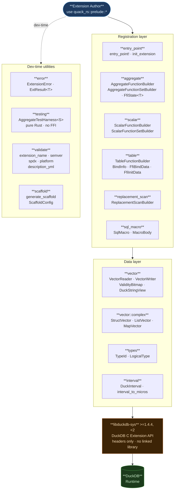

<div align="center">
  <picture>
    <source media="(prefers-color-scheme: dark)" srcset="assets/logos/logo1-dark-elegant.svg">
    
  </picture>
  <p><em>/ˈkwækərz/ &nbsp;·&nbsp; rhymes with <em>crackers</em> &nbsp;·&nbsp; inspired by DuckDB</em></p>
  <p>
    <a href="https://github.com/tomtom215/quack-rs/actions/workflows/ci.yml"></a>
    <a href="https://crates.io/crates/quack-rs"></a>
    <a href="https://quack-rs.com/"></a>
    <a href="https://opensource.org/licenses/MIT"></a>
    <a href="https://blog.rust-lang.org/2025/01/30/Rust-1.84.1.html"></a>
  </p>
</div>

**The Rust SDK for building DuckDB loadable extensions — no C, no C++, no glue code.**

`quack-rs` provides safe, production-grade wrappers for the [DuckDB C Extension API](https://duckdb.org/community_extensions/development), removing every known FFI pitfall so you can focus entirely on writing extension logic in pure Rust.

---

## Table of Contents

- [Why quack-rs?](#why-quack-rs)
- [What quack-rs Solves](#what-quack-rs-solves)
- [Quick Start](#quick-start)
  - [1. Add the dependency](#1-add-the-dependency)
  - [2. Write your extension](#2-write-your-extension)
  - [3. Scaffold a new project](#3-scaffold-a-new-project)
- [Module Reference](#module-reference)
- [FFI Pitfalls Reference](#ffi-pitfalls-reference)
- [Community Extension Compliance](#community-extension-compliance)
  - [description.yml validation](#descriptionyml-validation)
  - [Extension naming](#extension-naming)
  - [Platform targets](#platform-targets)
  - [Extension versioning](#extension-versioning)
  - [Release profile requirements](#release-profile-requirements)
- [Architecture](#architecture)
  - [Design principles](#design-principles)
  - [Safety model](#safety-model)
  - [Architecture Decision Records](#architecture-decision-records)
- [Testing strategy](#testing-strategy)
- [Known Limitations](#known-limitations)
- [Changelog](#changelog)
- [Contributing](#contributing)
- [License](#license)

---

## Why quack-rs?

The [DuckDB community extensions FAQ](https://duckdb.org/community_extensions/faq#can-i-write-extensions-in-rust) states:

> *Writing a Rust-based DuckDB extension requires writing glue code in C++ and will
> force you to build through DuckDB's CMake & C++ based extension template. We understand
> that this is not ideal and acknowledge the fact that Rust developers prefer to work on
> pure Rust codebases.*

The DuckDB C Extension API (available since v1.1) changes this. `quack-rs` wraps that API
and eliminates every rough edge, so you write **zero lines of C or C++**.

### What extension authors face without quack-rs

| Problem | Without quack-rs | With quack-rs |
|---------|-----------------|---------------|
| Entry point boilerplate | ~40 lines of `unsafe extern "C"` code | 1 macro call |
| State init/destroy | Raw `Box::into_raw` / `Box::from_raw` | `FfiState<T>` handles all of it |
| Boolean reads | UB if read as `bool` directly | `VectorReader::read_bool` uses `u8 != 0` |
| NULL output | Silent corruption if `ensure_validity_writable` skipped | `VectorWriter::set_null` calls it automatically |
| LogicalType memory | Leak if not freed | `LogicalType` implements `Drop` |
| Aggregate combine | Config fields lost on segment-tree merges | Testable with `AggregateTestHarness` |
| FFI panics | Process abort or undefined behavior | `init_extension` never panics |
| Table functions | ~100 lines of raw bind/init/scan callbacks | `TableFunctionBuilder` 5-method chain |
| Replacement scans | Undocumented vtable + manual string allocation | `ReplacementScanBuilder` 4-method chain |
| Complex types (STRUCT/LIST/MAP) | Manual offset arithmetic over child vectors | `StructVector`, `ListVector`, `MapVector` helpers |
| Complex param/return types | Raw `duckdb_create_logical_type` + manual lifecycle | `param_logical(LogicalType)` / `returns_logical(LogicalType)` on all builders |
| Extension naming | Rejected by DuckDB CI with no explanation | `validate_extension_name` catches issues before submission |
| description.yml | No tooling to validate before submission | `validate_description_yml_str` validates the whole file |
| New project setup | Hours of boilerplate + reading DuckDB internals | `generate_scaffold` produces all 11 required files |

---

## What quack-rs Solves

Building a DuckDB extension in Rust — from project setup to community submission — requires navigating undocumented C API contracts, FFI memory rules, and data-encoding specifics found only in DuckDB's source code, which surface as silent corruption, process aborts, or unexplained CI rejections rather than compiler errors. `quack-rs` eliminates these barriers systematically across the complete extension lifecycle — scaffolding, function registration, type-safe data access, aggregate testing, metadata validation, and community submission readiness — with every abstraction backed by a documented, reproducible pitfall in [`LESSONS.md`](./LESSONS.md), making correct behavior automatic and incorrect behavior a compile-time error wherever the type system permits. The result is that any Rust developer can build, test, and ship a production-quality DuckDB extension without prior knowledge of DuckDB internals, covering every extension type exposed by DuckDB's public C Extension API: scalar, aggregate, table, cast, replacement scan, and SQL macro functions.

`quack-rs` encapsulates **15 documented FFI pitfalls** — hard-won knowledge from building
real DuckDB extensions in Rust:

```
L1  COMBINE must propagate ALL config fields (not just data)
L2  State destroy double-free → FfiState<T> nulls pointers after free
L3  No panics across FFI → init_extension uses Result throughout
L4  ensure_validity_writable required before NULL output → VectorWriter handles it
L5  Boolean reading must use u8 != 0 → VectorReader enforces this
L6  Function set name must be set on EACH member → Set builders enforce on every member
L7  LogicalType memory leak → LogicalType implements Drop

P1  Library name must match [lib] name in Cargo.toml exactly
P2  C API version ("v1.2.0") ≠ DuckDB release version ("v1.4.4" / "v1.5.0")
P3  E2E SQLLogicTests required for community submission
P4  extension-ci-tools submodule must be initialized
P5  SQLLogicTest output must match DuckDB CLI output exactly
P6  Function registration can fail silently → builders check return values
P7  DuckDB strings use 16-byte format with inline and pointer variants
P8  INTERVAL is { months: i32, days: i32, micros: i64 } — not a single i64
```

See [`LESSONS.md`](./LESSONS.md) for full analysis of each pitfall.

---

## Quick Start

### 1. Add the dependency

```toml
[dependencies]
quack-rs = "0.4"
libduckdb-sys = { version = ">=1.4.4, <2", features = ["loadable-extension"] }
```

> **DuckDB compatibility**: `quack-rs` supports DuckDB **1.4.x and 1.5.x**.
> Both releases expose the same C API version (`v1.2.0`), confirmed by E2E tests
> against DuckDB 1.4.4 and DuckDB 1.5.0. The upper bound `<2` prevents silent
> adoption of a future major release that may change the C API. When the C API
> version changes, `quack-rs` will need to be updated and re-released.

### 2. Write your extension

```rust
// src/lib.rs
use quack_rs::prelude::*;

// Step 1: Define your aggregate state
#[derive(Default)]
struct WordCountState {
    count: i64,
}
impl AggregateState for WordCountState {}

// Step 2: Write callbacks using safe SDK helpers
unsafe extern "C" fn update(
    _info: libduckdb_sys::duckdb_function_info,
    chunk: libduckdb_sys::duckdb_data_chunk,
    states: *mut libduckdb_sys::duckdb_aggregate_state,
) {
    let reader = unsafe { VectorReader::new(chunk, 0) };
    for row in 0..reader.row_count() {
        if unsafe { reader.is_valid(row) } {
            let words = unsafe { reader.read_str(row) }
                .split_whitespace()
                .count() as i64;
            if let Some(state) =
                unsafe { FfiState::<WordCountState>::with_state_mut(*states.add(row)) }
            {
                state.count += words;
            }
        }
    }
}

unsafe extern "C" fn finalize(
    _info: libduckdb_sys::duckdb_function_info,
    states: *mut libduckdb_sys::duckdb_aggregate_state,
    result: libduckdb_sys::duckdb_vector,
    count: libduckdb_sys::idx_t,
    offset: libduckdb_sys::idx_t,
) {
    let mut writer = unsafe { VectorWriter::new(result) };
    for i in 0..count as usize {
        let idx = i + offset as usize;
        match unsafe { FfiState::<WordCountState>::with_state(*states.add(i)) } {
            Some(state) => unsafe { writer.write_i64(idx, state.count) },
            None => unsafe { writer.set_null(idx) },
        }
    }
}

unsafe extern "C" fn combine(
    _info: libduckdb_sys::duckdb_function_info,
    source: *mut libduckdb_sys::duckdb_aggregate_state,
    target: *mut libduckdb_sys::duckdb_aggregate_state,
    count: libduckdb_sys::idx_t,
) {
    for i in 0..count as usize {
        if let (Some(src), Some(tgt)) = (
            unsafe { FfiState::<WordCountState>::with_state(*source.add(i)) },
            unsafe { FfiState::<WordCountState>::with_state_mut(*target.add(i)) },
        ) {
            tgt.count += src.count;
        }
    }
}

// Step 3: Register using the builder
fn register(con: libduckdb_sys::duckdb_connection) -> ExtResult<()> {
    unsafe {
        AggregateFunctionBuilder::try_new("word_count")?
            .param(TypeId::Varchar)
            .returns(TypeId::BigInt)
            .state_size(FfiState::<WordCountState>::size_callback)
            .init(FfiState::<WordCountState>::init_callback)
            .update(update)
            .combine(combine)
            .finalize(finalize)
            .destructor(FfiState::<WordCountState>::destroy_callback)
            .register(con)?;
    }
    Ok(())
}

// Step 4: One macro call generates the entry point (pass the full symbol name DuckDB expects)
entry_point!(my_extension_init_c_api, |con| register(con));
```

### 3. Scaffold a new project

```rust
use quack_rs::scaffold::{generate_scaffold, ScaffoldConfig};

let config = ScaffoldConfig {
    name: "my_extension".to_string(),
    description: "Fast text analytics for DuckDB".to_string(),
    version: "0.1.0".to_string(),
    license: "MIT".to_string(),
    maintainer: "Your Name".to_string(),
    github_repo: "yourorg/duckdb-my-extension".to_string(),
    excluded_platforms: vec![], // or vec!["wasm_mvp".to_string(), ...]
};

let files = generate_scaffold(&config)?;
for file in &files {
    println!("{}", file.path);
    // write file.content to disk
}
```

This generates all 11 files required for a DuckDB community extension submission:

```
Cargo.toml                          ← cdylib, pinned deps, release profile
Makefile                            ← delegates to cargo + extension-ci-tools
extension_config.cmake              ← required by extension-ci-tools
src/lib.rs                          ← entry point template (no C++ needed)
src/wasm_lib.rs                     ← WebAssembly shim
description.yml                     ← community extension metadata
test/sql/my_extension.test          ← SQLLogicTest skeleton
.github/workflows/extension-ci.yml ← cross-platform CI (Linux/macOS/Windows)
.gitmodules                         ← extension-ci-tools submodule
.gitignore
.cargo/config.toml                  ← Windows CRT static linking
```

### 4. Append extension metadata

DuckDB loadable extensions require a metadata footer appended to the `.so`/`.dylib`/`.dll`
after `cargo build --release`. `quack-rs` ships a native Rust binary for this step,
replacing the Python `append_extension_metadata.py` script from the C++ template:

```shell
# Install the binary from the published crate
cargo install quack-rs --bin append_metadata

# Append metadata to your built extension (input .so → output .duckdb_extension)
append_metadata target/release/libmy_extension.so \
    my_extension.duckdb_extension \
    --duckdb-version v1.2.0 \
    --platform linux_amd64
```

> **Pitfall P2**: The `--duckdb-version` flag must be `v1.2.0` (the C API version),
> **not** the DuckDB release version (`v1.4.4` or `v1.5.0`). DuckDB 1.4.x and 1.5.x
> both use C API version `v1.2.0`. Use the `DUCKDB_API_VERSION` constant from
> `quack_rs` to avoid hard-coding the wrong value.

---

## Module Reference

| Module | Purpose | Key types / functions |
|--------|---------|----------------------|
| [`entry_point`] | Extension initialization entry point | `init_extension`, `init_extension_v2`, `entry_point!`, `entry_point_v2!` |
| [`connection`] | Version-agnostic extension registration facade | `Connection`, `Registrar` |
| [`aggregate`] | Aggregate function registration | `AggregateFunctionBuilder`, `AggregateFunctionSetBuilder` |
| [`aggregate::state`] | Generic FFI state management | `AggregateState`, `FfiState<T>` |
| [`aggregate::callbacks`] | Callback type aliases | `UpdateFn`, `CombineFn`, `FinalizeFn`, … |
| [`scalar`] | Scalar function registration | `ScalarFunctionBuilder`, `ScalarFunctionSetBuilder` |
| [`cast`] | Custom type cast functions | `CastFunctionBuilder`, `CastFunctionInfo`, `CastMode` |
| [`table`] | Table function registration (bind/init/scan) | `TableFunctionBuilder`, `BindInfo`, `FfiBindData`, `FfiInitData` |
| [`replacement_scan`] | `SELECT * FROM 'file.xyz'` replacement scans | `ReplacementScanBuilder` |
| [`sql_macro`] | SQL macro registration (no FFI callbacks) | `SqlMacro`, `MacroBody` |
| [`vector`] | Safe reading/writing of DuckDB vectors | `VectorReader`, `VectorWriter` |
| [`vector::complex`] | STRUCT / LIST / MAP child vector access | `StructVector`, `ListVector`, `MapVector` |
| [`vector::string`] | 16-byte DuckDB string format | `DuckStringView`, `read_duck_string` |
| [`types`] | DuckDB type system wrappers | `TypeId`, `LogicalType`, `NullHandling` |
| [`interval`] | INTERVAL ↔ microseconds conversion | `DuckInterval`, `interval_to_micros` |
| [`error`] | FFI-safe error type | `ExtensionError`, `ExtResult<T>` |
| [`config`] | RAII wrapper for DuckDB database configuration | `DbConfig` |
| [`validate`] | Community extension compliance | All validators below |
| [`validate::description_yml`] | description.yml parsing and validation | `parse_description_yml`, `DescriptionYml` |
| [`validate::extension_name`] | Extension naming rules | `validate_extension_name` |
| [`validate::function_name`] | SQL identifier rules | `validate_function_name` |
| [`validate::semver`] | Semantic versioning | `validate_semver`, `ExtensionStability` |
| [`validate::spdx`] | SPDX license identifiers | `validate_spdx_license` |
| [`validate::platform`] | DuckDB build targets | `validate_platform`, `DUCKDB_PLATFORMS` |
| [`validate::release_profile`] | Cargo release profile | `validate_release_profile` |
| [`scaffold`] | Project generator | `generate_scaffold`, `ScaffoldConfig` |
| [`testing`] | Pure-Rust aggregate test harness | `AggregateTestHarness<S>` |
| [`prelude`] | Common re-exports | `use quack_rs::prelude::*` |

[`entry_point`]: https://docs.rs/quack-rs/latest/quack_rs/entry_point/index.html
[`connection`]: https://docs.rs/quack-rs/latest/quack_rs/connection/index.html
[`aggregate`]: https://docs.rs/quack-rs/latest/quack_rs/aggregate/index.html
[`aggregate::state`]: https://docs.rs/quack-rs/latest/quack_rs/aggregate/state/index.html
[`aggregate::callbacks`]: https://docs.rs/quack-rs/latest/quack_rs/aggregate/callbacks/index.html
[`scalar`]: https://docs.rs/quack-rs/latest/quack_rs/scalar/index.html
[`cast`]: https://docs.rs/quack-rs/latest/quack_rs/cast/index.html
[`table`]: https://docs.rs/quack-rs/latest/quack_rs/table/index.html
[`replacement_scan`]: https://docs.rs/quack-rs/latest/quack_rs/replacement_scan/index.html
[`sql_macro`]: https://docs.rs/quack-rs/latest/quack_rs/sql_macro/index.html
[`vector`]: https://docs.rs/quack-rs/latest/quack_rs/vector/index.html
[`vector::complex`]: https://docs.rs/quack-rs/latest/quack_rs/vector/complex/index.html
[`vector::string`]: https://docs.rs/quack-rs/latest/quack_rs/vector/string/index.html
[`types`]: https://docs.rs/quack-rs/latest/quack_rs/types/index.html
[`interval`]: https://docs.rs/quack-rs/latest/quack_rs/interval/index.html
[`error`]: https://docs.rs/quack-rs/latest/quack_rs/error/index.html
[`config`]: https://docs.rs/quack-rs/latest/quack_rs/config/index.html
[`validate`]: https://docs.rs/quack-rs/latest/quack_rs/validate/index.html
[`validate::description_yml`]: https://docs.rs/quack-rs/latest/quack_rs/validate/description_yml/index.html
[`validate::extension_name`]: https://docs.rs/quack-rs/latest/quack_rs/validate/extension_name/index.html
[`validate::function_name`]: https://docs.rs/quack-rs/latest/quack_rs/validate/function_name/index.html
[`validate::semver`]: https://docs.rs/quack-rs/latest/quack_rs/validate/semver/index.html
[`validate::spdx`]: https://docs.rs/quack-rs/latest/quack_rs/validate/spdx/index.html
[`validate::platform`]: https://docs.rs/quack-rs/latest/quack_rs/validate/platform/index.html
[`validate::release_profile`]: https://docs.rs/quack-rs/latest/quack_rs/validate/release_profile/index.html
[`scaffold`]: https://docs.rs/quack-rs/latest/quack_rs/scaffold/index.html
[`testing`]: https://docs.rs/quack-rs/latest/quack_rs/testing/index.html
[`prelude`]: https://docs.rs/quack-rs/latest/quack_rs/prelude/index.html

---

## FFI Pitfalls Reference

The following table summarizes every known DuckDB Rust FFI pitfall and how `quack-rs` addresses
it. The full analysis — including symptoms, root cause, and minimal reproduction — is in
[`LESSONS.md`](./LESSONS.md).

### Logic Pitfalls (L)

| ID | Name | Symptom | quack-rs Solution |
|----|------|---------|-------------------|
| **L1** | COMBINE config propagation | Aggregate returns wrong results under parallelism | Testable with `AggregateTestHarness` |
| **L2** | Double-free in destroy | Heap corruption / SIGABRT | `FfiState<T>::destroy_callback` nulls pointer after free |
| **L3** | Panic across FFI | Process abort / UB | `init_extension` propagates `Result`, never panics |
| **L4** | Missing `ensure_validity_writable` | Segfault / silent NULL corruption | `VectorWriter::set_null` calls it automatically |
| **L5** | Boolean undefined behavior | Non-deterministic bool semantics | `VectorReader::read_bool` reads `u8 != 0` |
| **L6** | Function set name on each member | Silent registration failure | `AggregateFunctionSetBuilder` and `ScalarFunctionSetBuilder` set name on every member |
| **L7** | `LogicalType` memory leak | RSS grows with each extension load | `LogicalType` implements `Drop` |

### Practical Pitfalls (P)

| ID | Name | Symptom | quack-rs Solution |
|----|------|---------|-------------------|
| **P1** | Library name mismatch | Extension fails to load | Documented; scaffold sets it correctly |
| **P2** | C API version ≠ release version | Wrong `-dv` flag corrupts extension metadata | `DUCKDB_API_VERSION = "v1.2.0"` constant; `append_metadata` binary ships with the crate |
| **P3** | Missing E2E tests | Community submission rejected | Scaffold generates SQLLogicTest skeleton |
| **P4** | Uninitialized submodule | `make` fails with missing files | Documented; scaffold generates `.gitmodules` |
| **P5** | SQLLogicTest format mismatch | Tests fail with exact-match errors | Documented with format reference |
| **P6** | Registration failure not checked | Function silently not registered | Builders check and propagate return values |
| **P7** | DuckDB 16-byte string format | Garbled or truncated strings | `DuckStringView`, `read_duck_string` |
| **P8** | INTERVAL layout misunderstood | INTERVAL computed incorrectly | `DuckInterval` with `interval_to_micros` |

---

## Community Extension Compliance

`quack-rs` enforces every requirement from the
[DuckDB community extensions development guide](https://duckdb.org/community_extensions/development).

### description.yml validation

Every community extension must include a `description.yml` metadata file.
`quack-rs` can validate the entire file before submission:

```rust
use quack_rs::validate::description_yml::{
    parse_description_yml, validate_rust_extension, validate_description_yml_str,
};

// Quick pass/fail check
let result = validate_description_yml_str(include_str!("description.yml"));
assert!(result.is_ok(), "description.yml has errors: {}", result.unwrap_err());

// Structured access for programmatic inspection
let desc = parse_description_yml(include_str!("description.yml"))?;
println!("Extension: {} v{}", desc.name, desc.version);
println!("Maintainers: {:?}", desc.maintainers);

// Validate Rust-specific fields (language, build, toolchains)
validate_rust_extension(&desc)?;
```

**Validated fields:**

| Field | Rule |
|-------|------|
| `extension.name` | `^[a-z][a-z0-9_-]*$`, max 64 chars |
| `extension.version` | Semver or 7–40 char lowercase hex git hash |
| `extension.license` | Recognized SPDX identifier |
| `extension.excluded_platforms` | Semicolon-separated list of known DuckDB platforms |
| `extension.maintainers` | At least one maintainer required |
| `repo.github` | Must contain `/` (owner/repo format) |
| `repo.ref` | Non-empty git ref |

**Example `description.yml`:**

```yaml
extension:
  name: my_extension
  description: Fast text analytics for DuckDB.
  version: 0.1.0
  language: Rust
  build: cargo
  license: MIT
  requires_toolchains: rust;python3
  excluded_platforms: "wasm_mvp;wasm_eh;wasm_threads"
  maintainers:
    - Your Name

repo:
  github: yourorg/duckdb-my-extension
  ref: main
```

### Extension naming

Extensions submitted to the community repository must follow strict naming rules.
Validate before you submit:

```rust
use quack_rs::validate::{validate_extension_name, validate_function_name};

// Extension names: lowercase alphanumeric, hyphens and underscores allowed
assert!(validate_extension_name("my_analytics").is_ok());
assert!(validate_extension_name("MyExt").is_err());       // uppercase rejected
assert!(validate_extension_name("my ext").is_err());      // spaces rejected
assert!(validate_extension_name("").is_err());             // empty rejected

// Function/SQL identifier names: lowercase alphanumeric and underscores only
assert!(validate_function_name("word_count").is_ok());
assert!(validate_function_name("word-count").is_err());    // hyphens not allowed in SQL
assert!(validate_function_name("WordCount").is_err());     // uppercase rejected
```

### Platform targets

DuckDB community extensions must build for all 11 standard platforms or declare
explicit exclusions:

```
linux_amd64         linux_amd64_gcc4    linux_arm64
osx_amd64           osx_arm64
windows_amd64       windows_amd64_mingw windows_arm64
wasm_mvp            wasm_eh             wasm_threads
```

```rust
use quack_rs::validate::{validate_platform, validate_excluded_platforms_str, DUCKDB_PLATFORMS};

// Validate a single platform
assert!(validate_platform("linux_amd64").is_ok());
assert!(validate_platform("freebsd_amd64").is_err()); // not a DuckDB platform

// Validate the excluded_platforms field from description.yml
// (semicolon-separated, as it appears in the YAML file)
assert!(validate_excluded_platforms_str("wasm_mvp;wasm_eh;wasm_threads").is_ok());
assert!(validate_excluded_platforms_str("invalid_platform").is_err());
assert!(validate_excluded_platforms_str("").is_ok()); // empty = no exclusions

println!("All DuckDB platforms: {:?}", DUCKDB_PLATFORMS);
```

### Extension versioning

DuckDB extensions use a three-tier versioning scheme:

| Tier | Format | Example | Meaning |
|------|--------|---------|---------|
| **Unstable** | Short git hash | `690bfc5` | No stability guarantees |
| **Pre-release** | Semver `0.y.z` | `0.1.0` | Working toward stability |
| **Stable** | Semver `x.y.z` (x ≥ 1) | `1.0.0` | Full semver semantics |

```rust
use quack_rs::validate::{validate_extension_version, validate_semver};
use quack_rs::validate::semver::{classify_extension_version, ExtensionStability};

// validate_extension_version accepts both semver and git hashes
assert!(validate_extension_version("1.0.0").is_ok());
assert!(validate_extension_version("0.1.0").is_ok());
assert!(validate_extension_version("690bfc5").is_ok()); // git hash (unstable)
assert!(validate_extension_version("").is_err());

// Classify the stability tier
let (stability, _) = classify_extension_version("1.0.0").unwrap();
assert_eq!(stability, ExtensionStability::Stable);

let (stability, _) = classify_extension_version("0.1.0").unwrap();
assert_eq!(stability, ExtensionStability::PreRelease);

let (stability, _) = classify_extension_version("690bfc5").unwrap();
assert_eq!(stability, ExtensionStability::Unstable);
```

### Release profile requirements

DuckDB loadable extensions are shared libraries. The Cargo release profile must be
configured correctly:

```toml
[profile.release]
panic = "abort"     # REQUIRED: panics across FFI are undefined behavior
lto = true          # Recommended: reduces binary size
codegen-units = 1   # Recommended: better optimization quality
opt-level = 3       # Recommended: maximum performance
strip = true        # Recommended: smaller binary
```

```rust
use quack_rs::validate::validate_release_profile;

// Validate from parsed Cargo.toml values
let check = validate_release_profile("abort", "true", "3", "1").unwrap();
assert!(check.is_fully_optimized());
assert!(check.panic_abort);       // REQUIRED
assert!(check.lto_enabled);       // recommended
assert!(check.opt_level_3);       // recommended
assert!(check.codegen_units_1);   // recommended

// Missing panic=abort is rejected with a descriptive error
let err = validate_release_profile("unwind", "true", "3", "1").unwrap_err();
assert!(err.as_str().contains("panic"));
```

---

## Architecture

### Module dependency graph



### Design principles

1. **Thin wrapper mandate**: Every abstraction must pay for itself in reduced boilerplate
   or improved safety. When in doubt, prefer simplicity over cleverness.

2. **No panics across FFI**: `unwrap()` and `panic!()` are forbidden in any code path that
   crosses the FFI boundary. All errors propagate as `Result<T, ExtensionError>`.

3. **Bounded version range**: `libduckdb-sys = ">=1.4.4, <2"` is deliberate.
   The C API is stable across DuckDB 1.4.x and 1.5.x (verified by E2E tests on both).
   The upper bound prevents silent adoption of a future major release. When the C API
   version changes, `quack-rs` will be updated.

4. **Testable business logic**: Aggregate state structs have zero FFI dependencies. They
   can be tested in isolation using `AggregateTestHarness<S>` without a DuckDB runtime.

5. **Enforce community standards**: The `validate` module makes it impossible to accidentally
   submit a non-compliant extension. Validation errors are caught at build time, not
   submission time.

### Safety model

All `unsafe` code within `quack-rs` is sound and documented. Extension authors must write
`unsafe extern "C"` callback functions (required by DuckDB's C API), but the SDK's helpers
(`FfiState`, `VectorReader`, `VectorWriter`) minimize the surface area of unsafe code
within those callbacks. Every `unsafe` block in this crate has a `// SAFETY:` comment
explaining the invariants being upheld.

```rust
// Extension author code: no unsafe required
fn register(con: duckdb_connection) -> ExtResult<()> {
    AggregateFunctionBuilder::try_new("word_count")?
        .param(TypeId::Varchar)
        .returns(TypeId::BigInt)
        // ... callbacks (which are unsafe extern "C" fns) ...
        .register(con)          // unsafe is inside the SDK
}
```

### Architecture Decision Records

**ADR-1: Thin Wrapper Mandate**

`quack-rs` wraps, but does not redesign, the DuckDB C API. We do not invent new abstractions
that would require understanding two APIs. Extension authors who want to go below the SDK can
use `libduckdb-sys` directly — the two libraries compose without conflict.

**ADR-2: Bounded Version Range**

`libduckdb-sys = ">=1.4.4, <2"` is intentional. The DuckDB C Extension API is stable
across 1.4.x and 1.5.x — verified by E2E tests against DuckDB 1.4.4 and DuckDB 1.5.0.
Both releases use C API version `v1.2.0`. The upper bound `<2` prevents silent adoption
of a future major-band release that may change the C API version or callback signatures.
When a future DuckDB release bumps the C API version, `quack-rs` will need to be updated
to match.

**ADR-3: No Panics Across FFI**

The Rust reference is explicit: unwinding across an FFI boundary is undefined behavior.
`quack-rs` enforces this architecturally: every FFI boundary in the SDK is wrapped by
`init_extension`, which converts `Result::Err` into a DuckDB error report via `set_error`.
No `unwrap()`, `expect()`, or `panic!()` appears in any code path reachable from a DuckDB
callback.

---

## Testing strategy

`quack-rs` uses four layers of tests:

### 1. Unit tests (in every source file)

Each module contains `#[cfg(test)]` unit tests that verify pure-Rust behavior without
a DuckDB runtime. These test state machine correctness, builder field storage, validation
logic, and the `description.yml` parser.

### 2. Property-based tests (proptest)

The `interval` module and `AggregateTestHarness` include proptest-based tests:

- `interval_to_micros` overflow is detected for all possible field combinations
- `AggregateTestHarness::combine` associativity holds for sum aggregates
- `combine` identity element property: combining with empty state is idempotent

### 3. Integration tests (`tests/integration_test.rs`)

Pure-Rust cross-module tests that exercise the public API without a live DuckDB process.
These cover `DuckInterval`, `TypeId`, `FfiState<T>` lifecycle, `AggregateTestHarness`,
`ExtensionError`, `VectorReader`/`VectorWriter` layout, `DuckStringView`, and `SqlMacro`.

### 4. Example extension (`examples/hello-ext`)

A complete, working aggregate extension (`word_count`) that compiles and runs against a real
DuckDB process. This serves as both a comprehensive end-to-end test and a reference
implementation for extension authors.

### Testing aggregate logic without DuckDB

The `AggregateTestHarness<S>` type lets you test aggregate state logic in isolation:

```rust
use quack_rs::testing::AggregateTestHarness;
use quack_rs::aggregate::AggregateState;

#[derive(Default)]
struct SumState { total: i64 }
impl AggregateState for SumState {}

// Test update logic
let result = AggregateTestHarness::<SumState>::aggregate(
    [10_i64, 20, 30],
    |s, v| s.total += v,
);
assert_eq!(result.total, 60);

// Test combine: verify config fields are propagated (Pitfall L1)
let mut source = AggregateTestHarness::<SumState>::new();
source.update(|s| s.total = 100);

let mut target = AggregateTestHarness::<SumState>::new();
target.combine(&source, |src, tgt| tgt.total += src.total);

assert_eq!(target.finalize().total, 100);
```

---

## Known Limitations

### Window functions and COPY functions are not available

DuckDB's **window functions** (`OVER (...)` clauses) and **COPY format handlers** (custom
file-format readers/writers) are implemented entirely in the C++ API layer and have
**no counterpart in DuckDB's public C extension API**. This is not a gap in `quack-rs` or
in `libduckdb-sys` — the symbols (`duckdb_create_window_function`,
`duckdb_create_copy_function`, etc.) do not exist in the C API at all.

This has been verified against:
- The [DuckDB stable C API reference](https://duckdb.org/docs/stable/clients/c/api)
  (no window or COPY function registration symbols listed)
- The `libduckdb-sys` 1.4.4 bindings (`bindgen_bundled_version.rs` and
  `bindgen_bundled_version_loadable.rs`) — neither file contains these symbols

If DuckDB exposes these APIs in a future C API version, `quack-rs` will add wrappers
in the relevant release.

---

## Changelog

See [`CHANGELOG.md`](./CHANGELOG.md) for the full version history.

**Unreleased** — Added `param_logical(LogicalType)` and `returns_logical(LogicalType)` on
all function builders (scalar, aggregate, and their set variants), enabling complex
parameterized types like `LIST(BOOLEAN)` or `MAP(VARCHAR, INTEGER)` without raw FFI.
Added per-overload `null_handling(NullHandling)` on set overload builders.

**v0.4.0** (2026-03-09) — Added `Connection` and `Registrar` trait (version-agnostic
registration facade), `init_extension_v2`, `entry_point_v2!` macro, and `duckdb-1-5` feature
flag. Broadened `libduckdb-sys` support from an exact `=1.4.4` pin to `>=1.4.4, <2`, covering
DuckDB 1.4.x and 1.5.x.

**v0.3.0** (2026-03-08) — Added `TableFunctionBuilder`, `ReplacementScanBuilder`,
`CastFunctionBuilder`, complex vector types (`StructVector`, `ListVector`, `MapVector`),
`write_interval`, `DbConfig`, `append_metadata` binary, cross-platform CI (Linux/macOS/Windows).

**v0.2.0** (2026-03-07) — Added `validate::description_yml` module, `prelude` module,
scaffold improvements (`extension_config.cmake`, SQLLogicTest, GitHub Actions CI),
`ScalarFunctionBuilder`, `entry_point!` macro, vector writer improvements, Windows CI.

**v0.1.0** (2025-05-01) — Initial release with all core modules.

---

## Contributing

See [`CONTRIBUTING.md`](./CONTRIBUTING.md) for the development guide, quality gates,
and how to run the full test suite.

**Quality gates (all required before merge):**

```shell
cargo test --all-targets                      # all tests pass
cargo clippy --all-targets -- -D warnings     # no clippy warnings
cargo fmt -- --check                          # code is formatted
cargo doc --no-deps                           # docs compile without warnings
cargo check                                   # MSRV check (Rust 1.84.1)
```

---

## License

MIT — see [`LICENSE`](./LICENSE).

---

*`quack-rs` is a community project. It is not affiliated with or endorsed by DuckDB Labs.*
*Built with care for the open-source and Rust communities.*
