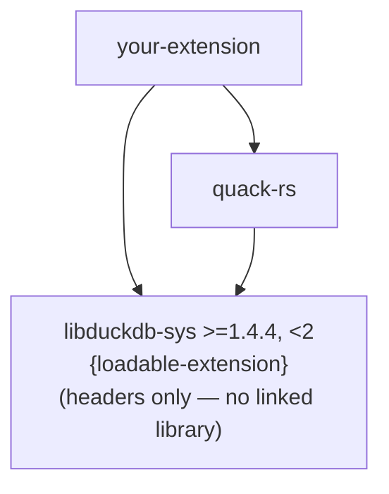

# Extension Anatomy

A DuckDB loadable extension is a shared library (`.so` / `.dylib` / `.dll`) that DuckDB loads
at runtime. Understanding what DuckDB expects makes every other part of quack-rs click.

---

## The initialization sequence

When DuckDB loads your extension, it:

1. Opens the shared library and looks up the symbol `{name}_init_c_api`
2. Calls that function with an `info` handle and a pointer to function dispatch pointers
3. Your function must:
   a. Call `duckdb_rs_extension_api_init(info, access, api_version)` to initialize the dispatch table
   b. Get the `duckdb_database` handle via `access.get_database(info)`
   c. Open a `duckdb_connection` via `duckdb_connect`
   d. Register functions on that connection
   e. Disconnect
   f. Return `true` (success) or `false` (failure)

`quack_rs::entry_point::init_extension` performs all of this correctly. The `entry_point!`
macro generates the required `#[no_mangle] extern "C"` symbol:

```rust
entry_point!(my_extension_init_c_api, |con| register(con));
// emits: #[no_mangle] pub unsafe extern "C" fn my_extension_init_c_api(...)
```

---

## Symbol naming

The symbol name **must** be `{extension_name}_init_c_api` — all lowercase, underscores only.
If the symbol is missing or misnamed, DuckDB fails to load the extension.

```
Extension name: "word_count_ext"
Required symbol: word_count_ext_init_c_api
```

Pass the full symbol name to `entry_point!`. This keeps the exported name explicit and
visible at the call site — no hidden identifier manipulation at compile time.

---

## The `loadable-extension` feature

`libduckdb-sys` with `features = ["loadable-extension"]` changes how DuckDB API functions
work fundamentally:

```
Without feature:  duckdb_query(...)  →  calls linked libduckdb directly
With feature:     duckdb_query(...)  →  dispatches through an AtomicPtr table
```

The `AtomicPtr` table starts as null. DuckDB fills it in by calling
`duckdb_rs_extension_api_init`. This means:

- **Any call before `duckdb_rs_extension_api_init` panics** with `"DuckDB API not initialized"`
- **In `cargo test`, you cannot call any `duckdb_*` function** — the table is never initialized

This is why `quack-rs` uses `AggregateTestHarness` for testing: it simulates the aggregate
lifecycle in pure Rust, with zero DuckDB API calls.

---

## Dependency model



The `loadable-extension` feature produces a shared library that **does not statically link
DuckDB**. Instead, it receives DuckDB's function pointers at load time. This is the correct
model for extensions: you run inside DuckDB's process, using its memory and threading.

---

## Version support

`libduckdb-sys = ">=1.4.4, <2"` — the bounded range is intentional.

DuckDB 1.4.x and 1.5.x both expose **C API version `v1.2.0`** (the version string embedded
in `duckdb_rs_extension_api_init`). `quack-rs` has been E2E tested against both releases.
Using a range rather than an exact pin means:

- Extension authors can choose their DuckDB target (pin to `=1.4.4` or `=1.5.0` in their
  own `Cargo.toml`) and resolve cleanly against `quack-rs`
- `quack-rs` itself doesn't force a DuckDB downgrade on users

The `<2` upper bound is equally intentional: it prevents silent adoption of a future major
release that may introduce breaking C API changes. Upgrading beyond the `1.x` band requires
an explicit `quack-rs` release that audits the new C API surface.

> **For your own extension's `Cargo.toml`:** pin `libduckdb-sys` to the exact DuckDB version
> you build and test against (e.g., `=1.5.0`). Your extension binary will only load in the
> DuckDB version it was compiled for regardless — the range only matters for `quack-rs`
> itself as a library dependency.

---

## Binary compatibility

Extension binaries are tied to a specific DuckDB version and platform. Key facts:

- An extension compiled for DuckDB 1.4.4 will **not** load in DuckDB 1.5.0
- DuckDB verifies binary compatibility at load time and refuses mismatched binaries
- Official DuckDB extensions are cryptographically signed; community extensions are not
- To load unsigned extensions: `SET allow_unsigned_extensions = true` (development only)
- The community extension CI provides automated cross-platform builds for each DuckDB release
