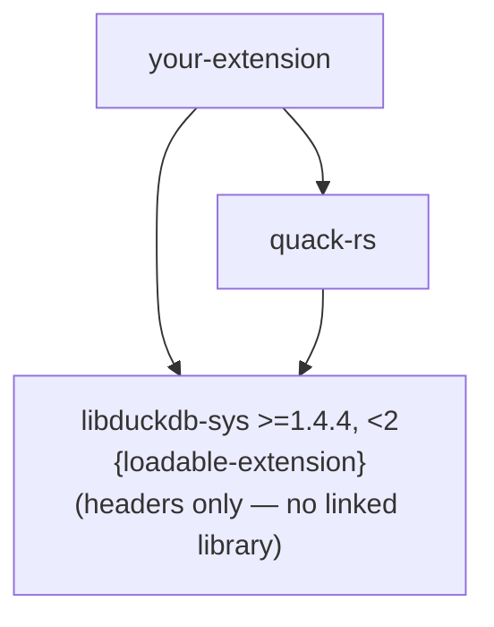

# Extension Anatomy

A DuckDB loadable extension is a shared library (`.so` / `.dylib` / `.dll`) that DuckDB loads
at runtime. This page covers what DuckDB expects of a Rust extension built on the C Extension
API: the entry-point symbol, the initialization sequence, the `loadable-extension` dispatch
table, and version and binary compatibility.

---

## The initialization sequence

When DuckDB loads your extension, it:

1. Opens the shared library and looks up the symbol `{name}_init_c_api`, where `{name}` is
   the extension name
2. Calls that function with an `info` handle and a pointer to a `duckdb_extension_access`
   struct (the `set_error`, `get_database` and `get_api` callbacks)
3. Your function must:
   1. Call `duckdb_rs_extension_api_init(info, access, api_version)` to initialize the dispatch table
   2. Get the `duckdb_database` handle via `access.get_database(info)`
   3. Open a `duckdb_connection` via `duckdb_connect`
   4. Register functions on that connection
   5. Disconnect
   6. Return `true` (success) or `false` (failure), reporting any error through `access.set_error`

`quack_rs::entry_point::init_extension` performs this sequence. It also checks the C API
layout before registration (see [ABI Compatibility](abi.md)) and converts a panic in your
registration code into a load error. The `entry_point!` macro generates the required
`#[no_mangle] extern "C"` symbol:

```rust
# use quack_rs::entry_point;
# use quack_rs::error::ExtensionError;
# fn register(_con: libduckdb_sys::duckdb_connection) -> Result<(), ExtensionError> { Ok(()) }
entry_point!(my_extension_init_c_api, |con| register(con));
// emits: #[no_mangle] pub unsafe extern "C" fn my_extension_init_c_api(...)
```

---

## Symbol naming

The symbol name **must** be `{extension_name}_init_c_api`. Extension names use lowercase ASCII
letters, digits and underscores only (no hyphens, which cannot appear in a C symbol).
If the symbol is missing or misnamed, DuckDB fails to load the extension.

```text
Extension name: "word_count_ext"
Required symbol: word_count_ext_init_c_api
```

Pass the full symbol name to `entry_point!`. The exported name then appears verbatim at the
call site; the macro does not build identifiers at compile time.

---

## The `loadable-extension` feature

With `features = ["loadable-extension"]`, `libduckdb-sys` does not link DuckDB; every C API
function dispatches through a table of function pointers instead:

```text
Without feature:  duckdb_query(...)  →  calls linked libduckdb directly
With feature:     duckdb_query(...)  →  dispatches through an AtomicPtr table
```

The `AtomicPtr` table starts as null. The extension's entry point fills it by calling
`duckdb_rs_extension_api_init`, which copies the pointers out of the API struct DuckDB
provides. This means:

- **Any call before `duckdb_rs_extension_api_init` panics** with
  `"DuckDB API not initialized or DuckDB feature omitted"`
- **In a plain `cargo test`, you cannot call any `duckdb_*` function** — no DuckDB host
  process ever initializes the table

This is why `quack-rs` offers `AggregateTestHarness` for testing: it simulates the aggregate
lifecycle in pure Rust, without calling the DuckDB API. For SQL-level tests, the
`bundled-test` / `bundled-test-prebuilt` features link a real DuckDB and fill the table
when `InMemoryDb::open()` runs (see [Testing Guide](../testing.md)).

---

## Dependency model


```mermaid
graph TD
    EXT["your-extension"]
    QR["quack-rs"]
    LDS["libduckdb-sys >=1.4.4, <2<br/>{loadable-extension}<br/>(headers only — no linked library)"]

    EXT --> QR
    EXT --> LDS
    QR  --> LDS
```

The `loadable-extension` feature produces a shared library that **does not statically link
DuckDB**. Instead, it receives DuckDB's function pointers at load time, so the extension runs
inside the host DuckDB process and uses that process's DuckDB instance, memory and threads.

---

## Version support

`libduckdb-sys = ">=1.4.4, <2"` — the bounded range is intentional.

Every DuckDB 1.4.x and 1.5.x release loads extensions built for **C API version `v1.2.0`**
(the version string passed to `duckdb_rs_extension_api_init`, `quack_rs::DUCKDB_API_VERSION`).
DuckDB 1.5.6 declares C API version `v1.5.6` and still accepts `v1.2.0` extensions. CI loads
the example extension into DuckDB 1.4.4, 1.5.0, 1.5.5 and the latest release.
Using a range rather than an exact pin means:

- Extension authors can choose which `libduckdb-sys` release to build against (for example
  `=1.4.4` for DuckDB 1.4.4, or `~1.10505.0` for DuckDB 1.5.5, which `libduckdb-sys`
  numbers `1.10505.x`) and still resolve against `quack-rs`
- `quack-rs` itself doesn't force a DuckDB downgrade on users

The `<2` upper bound is equally intentional: it prevents silent adoption of a future major
release that may introduce breaking C API changes. Upgrading beyond the `1.x` band requires
an explicit `quack-rs` release that audits the new C API surface.

> **For your own extension's `Cargo.toml`:** an extension that uses only the stable C API
> (the default quack-rs features) can keep the same `">=1.4.4, <2"` range; this is what
> `scaffold::generate_scaffold` writes. An extension that enables the `duckdb-1-5*` features must pin
> `libduckdb-sys` to the bindings of the one DuckDB release it is stamped for (the scaffold
> writes `~1.10505.0` for `v1.5.5`). See [ABI Compatibility](abi.md).

---

## Binary compatibility

Which DuckDB releases accept an extension binary depends on the ABI type stamped into its
metadata footer:

- A `C_STRUCT` binary targeting C API `v1.2.0` (the default, stable API only) loads into
  every DuckDB release whose C API version is at least `v1.2.0` — all of 1.4.x and 1.5.x —
  on the platform it was built for
- A `C_STRUCT_UNSTABLE` binary (required with the `duckdb-1-5*` features) loads only into
  the exact DuckDB release it names
- DuckDB checks the footer's platform and version fields at load time and refuses a mismatch
- Core and community extensions are signed; a binary you build locally is not
- To load an unsigned extension during development, start DuckDB with `allow_unsigned_extensions`
  enabled (`duckdb -unsigned` in the CLI); the setting cannot be changed on a running database
- The community extension CI builds and signs each extension for every supported platform
