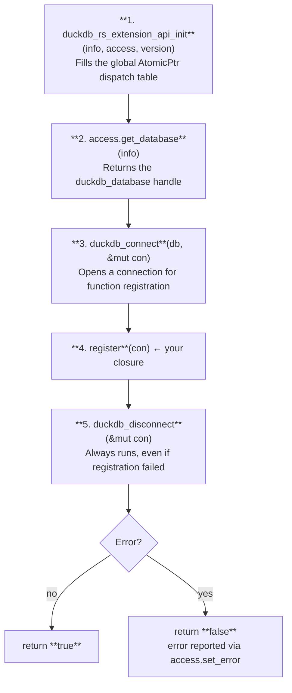

# The Entry Point

Every DuckDB extension must export a single C-callable symbol that DuckDB invokes at load time.
quack-rs provides two ways to create it.

---

## Option A: The `entry_point!` macro (recommended)

```rust
use quack_rs::entry_point;
use quack_rs::error::ExtensionError;

fn register(con: libduckdb_sys::duckdb_connection) -> Result<(), ExtensionError> {
    unsafe {
        // register your functions here
        Ok(())
    }
}

entry_point!(my_extension, |con| register(con));
```

This generates:

```rust
#[no_mangle]
pub unsafe extern "C" fn my_extension_init_c_api(
    info: duckdb_extension_info,
    access: *const duckdb_extension_access,
) -> bool {
    unsafe {
        quack_rs::entry_point::init_extension(
            info, access, quack_rs::DUCKDB_API_VERSION,
            |con| register(con),
        )
    }
}
```

The macro name is the extension name. The symbol `{name}_init_c_api` must match the
`name` field in `description.yml` and the `[lib] name` in `Cargo.toml`.

---

## Option B: Manual entry point

If you need full control (e.g., multiple registration functions, conditional logic):

```rust
use quack_rs::entry_point::init_extension;
use libduckdb_sys::{duckdb_extension_info, duckdb_extension_access};

#[no_mangle]
pub unsafe extern "C" fn my_extension_init_c_api(
    info: duckdb_extension_info,
    access: *const duckdb_extension_access,
) -> bool {
    unsafe {
        init_extension(info, access, quack_rs::DUCKDB_API_VERSION, |con| {
            register_scalar_functions(con)?;
            register_aggregate_functions(con)?;
            register_sql_macros(con)?;
            Ok(())
        })
    }
}
```

---

## What `init_extension` does



Errors from step 4 are reported back to DuckDB via `access.set_error` and the function
returns `false`. DuckDB then surfaces the error message to the user.

---

## The C API version constant

```rust
pub const DUCKDB_API_VERSION: &str = "v1.2.0";
```

> **Pitfall P2**: This is the **C API version**, not the DuckDB release version.
> DuckDB 1.4.4 uses C API version `v1.2.0`. Passing the wrong string causes the metadata
> script to fail or produce incorrect metadata.
> See [Pitfall P2](../reference/pitfalls.md#p2-extension-metadata-version-is-c-api-version).

---

## No panics in the entry point

`init_extension` never panics. All error paths use `Result` and `?`. If your registration
closure returns `Err`, the error message is reported to DuckDB via `access.set_error` and
the extension fails to load gracefully.

Never use `unwrap()` or `expect()` in FFI callbacks.
See [Pitfall L3](../reference/pitfalls.md#l3-no-panic-across-ffi-boundaries).
