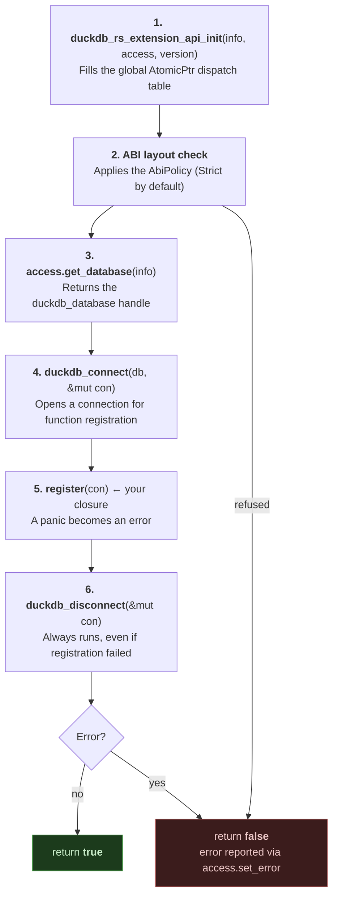

# The Entry Point

Every DuckDB loadable extension exports one C-callable entry-point function, which DuckDB
calls when it loads the extension. quack-rs generates it with the `entry_point_v2!` or
`entry_point!` macro, or you can write it by hand around `init_extension`.

---

## Option A: `entry_point_v2!` with `Connection` (recommended)

*Added in v0.4.0.*

The `entry_point_v2!` macro gives your closure a `&Connection` instead of a raw
`duckdb_connection`. The `Connection` type implements the `Registrar` trait, which
registers every kind of function, macro, cast, copy function and config option;
replacement scans, which belong to the database rather than a connection, are
`Connection`'s own methods:

```rust,ignore
use quack_rs::entry_point_v2;
use quack_rs::connection::{Connection, Registrar};
use quack_rs::error::ExtensionError;

unsafe fn register(con: &Connection) -> Result<(), ExtensionError> {
    unsafe {
        con.register_scalar(/* ScalarFunctionBuilder */)?;
        con.register_aggregate(/* AggregateFunctionBuilder */)?;
        con.register_table(/* TableFunctionBuilder */)?;
        con.register_cast(/* CastFunctionBuilder */)?;
        con.register_scalar_set(/* ScalarFunctionSetBuilder */)?;
        con.register_aggregate_set(/* AggregateFunctionSetBuilder */)?;
        con.register_sql_macro(/* SqlMacro */)?;
        con.register_replacement_scan(/* callback, data, destructor */);
        // con.register_copy_function(/* CopyFunctionBuilder */)?;  // requires duckdb-1-5
    }
    Ok(())
}

entry_point_v2!(my_extension_init_c_api, |con| unsafe { register(con) });
```

(The `register_*` arguments above are placeholders, so that block is not
compilable as written.) The macro emits the equivalent of the following; the real
expansion also evaluates the policy and closure arguments inside a panic guard:

```rust
# use libduckdb_sys::{duckdb_extension_access, duckdb_extension_info};
# use quack_rs::connection::Connection;
# use quack_rs::error::ExtensionError;
# unsafe fn register(_con: &Connection) -> Result<(), ExtensionError> { Ok(()) }
#[no_mangle]
pub unsafe extern "C" fn my_extension_init_c_api(
    info: duckdb_extension_info,
    access: *const duckdb_extension_access,
) -> bool {
    unsafe {
        quack_rs::entry_point::init_extension_v2_with_policy(
            info, access, quack_rs::DUCKDB_API_VERSION,
            quack_rs::abi::AbiPolicy::Strict,
            |con| unsafe { register(con) },
        )
    }
}
```

`entry_point_v2!(name, policy, |con| ...)` passes a different `AbiPolicy`.

Pass the **full symbol name** to the macro. The symbol `{name}_init_c_api` must match the
`name` field in `description.yml` and the `[lib] name` in `Cargo.toml`.

### Why `Connection` over raw `duckdb_connection`?

| | `entry_point!` (raw) | `entry_point_v2!` (Connection) |
|---|---|---|
| Receives | `duckdb_connection` | `&Connection` |
| Registration | Call builders' `.register(con)` | Call `con.register_*()` |
| Type safety | Raw pointer | Typed wrapper around the connection and database handles |
| Replacement scans | Need the database handle, which the closure does not receive | `con.register_replacement_scan*()` |

---

## Option B: The `entry_point!` macro

The original macro passes a raw `duckdb_connection` to your closure. It performs the
same initialization, but you pass the connection to each builder's `.register()`:

```rust
use quack_rs::entry_point;
use quack_rs::error::ExtensionError;

fn register(con: libduckdb_sys::duckdb_connection) -> Result<(), ExtensionError> {
    // Register each function on `con`, e.g. `unsafe { builder.register(con)? };`
    let _ = con;
    Ok(())
}

entry_point!(my_extension_init_c_api, |con| register(con));
```

---

## Option C: Manual entry point

If you need full control (e.g., multiple registration functions, conditional logic):

```rust
use quack_rs::entry_point::init_extension;
use libduckdb_sys::{duckdb_extension_info, duckdb_extension_access};
# use libduckdb_sys::duckdb_connection;
# use quack_rs::error::ExtensionError;
# fn register_scalar_functions(_: duckdb_connection) -> Result<(), ExtensionError> { Ok(()) }
# fn register_aggregate_functions(_: duckdb_connection) -> Result<(), ExtensionError> { Ok(()) }
# fn register_sql_macros(_: duckdb_connection) -> Result<(), ExtensionError> { Ok(()) }

#[no_mangle]
pub unsafe extern "C" fn my_extension_init_c_api(
    info: duckdb_extension_info,
    access: *const duckdb_extension_access,
) -> bool {
    unsafe {
        init_extension(info, access, quack_rs::DUCKDB_API_VERSION, |con| {
            register_scalar_functions(con)?;
            register_aggregate_functions(con)?;
            register_sql_macros(con)?;
            Ok(())
        })
    }
}
```

---

## What `init_extension` does


```mermaid
flowchart TD
    A["<b>1. duckdb_rs_extension_api_init</b>(info, access, version)<br/>Fills the global AtomicPtr dispatch table"]
    L["<b>2. ABI layout check</b><br/>Applies the AbiPolicy (Strict by default)"]
    B["<b>3. access.get_database</b>(info)<br/>Returns the duckdb_database handle"]
    C["<b>4. duckdb_connect</b>(db, &amp;mut con)<br/>Opens a connection for function registration"]
    D["<b>5. register</b>(con) ← your closure<br/>A panic becomes an error"]
    E["<b>6. duckdb_disconnect</b>(&amp;mut con)<br/>Always runs, even if registration failed"]
    F{Error?}
    G["return <b>true</b>"]
    H["return <b>false</b><br/>error reported via access.set_error"]

    A --> L --> B --> C --> D --> E --> F
    L -->|refused| H
    F -->|no| G
    F -->|yes| H

    style G fill:#1c3b1c,stroke:#4a9e4a,color:#c8ecc8
    style H fill:#3b1c1c,stroke:#9e4a4a,color:#ecc8c8
```

An error from any step, including an `Err` or a panic from your closure in step 5, is
reported to DuckDB via `access.set_error`, and the function returns `false`. DuckDB then
fails the `LOAD` with that message. (When DuckDB itself detects the failure, as when
`get_database` returns null, quack-rs returns `false` without overwriting DuckDB's own
message.) The layout check in step 2 only runs when a `duckdb-1-5*`
feature is enabled; see [ABI Compatibility](abi.md).

Registration is not transactional: functions registered before a failure stay registered
for the life of the database. Do fallible setup work (reading configuration, building
lookup tables) before the first `register` call.

---

## The C API version constant

```rust
pub const DUCKDB_API_VERSION: &str = "v1.2.0";
```

> **Pitfall P2**: This is the **C API version**, not the DuckDB release version.
> DuckDB 1.4.x and 1.5.0–1.5.5 declare C API version `v1.2.0`; 1.5.6 declares `v1.5.6` and
> still loads extensions that target `v1.2.0` (DuckDB accepts any C API version up to its own).
> A binary stamped with a DuckDB release version instead (`-dv v1.5.5`) is refused at `LOAD`
> by every DuckDB whose C API version is lower; quack-rs's `append_metadata` rejects such a
> value for `C_STRUCT` up front.
> See [Pitfall P2](../reference/pitfalls.md#p2-metadata-version-is-c-api-version-not-duckdb-version).

---

## No panics in the entry point

`init_extension` never panics. All error paths use `Result` and `?`. If your registration
closure returns `Err` or panics, the message is reported to DuckDB via `access.set_error`
and the `LOAD` fails with an error instead of aborting the process. Catching a panic
requires `panic = "unwind"` in your release profile (the scaffold's default).

Never use `unwrap()` or `expect()` in FFI callbacks.
See [Pitfall L3](../reference/pitfalls.md#l3-no-panic-across-ffi-boundaries).
