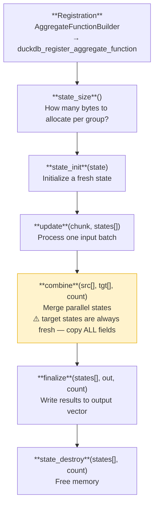

# Aggregate Functions

Aggregate functions reduce multiple rows into a single value per group — like `SUM()`,
`COUNT()`, or `AVG()`. DuckDB supports parallel aggregation, which introduces a `combine`
step that merges partial results from parallel workers.

---

## The aggregate lifecycle



DuckDB may call `combine` multiple times as it merges results from parallel segments.
**Target states in `combine` are always fresh (zero-initialized via `state_init`).**

---

## Registration

```rust
use quack_rs::aggregate::AggregateFunctionBuilder;
use quack_rs::types::TypeId;

unsafe fn register(con: duckdb_connection) -> Result<(), ExtensionError> {
    unsafe {
        AggregateFunctionBuilder::new("my_agg")
            .param(TypeId::Varchar)       // input type(s)
            .returns(TypeId::BigInt)      // output type
            .state_size(state_size)
            .init(state_init)
            .update(update)
            .combine(combine)
            .finalize(finalize)
            .destructor(state_destroy)
            .register(con)?;
    }
    Ok(())
}
```

All six callbacks must be set before `register` — the builder will return an error if any
are missing.

---

## Callback signatures

### `state_size`

```rust
unsafe extern "C" fn state_size(_info: duckdb_function_info) -> idx_t {
    FfiState::<MyState>::size_callback(_info)
}
```

Returns the size DuckDB must allocate per group. This is always `size_of::<*mut MyState>()`
— a pointer, since `FfiState<T>` stores a `Box<T>` pointer in the allocated slot.

### `state_init`

```rust
unsafe extern "C" fn state_init(info: duckdb_function_info, state: duckdb_aggregate_state) {
    unsafe { FfiState::<MyState>::init_callback(info, state) };
}
```

Allocates a `Box<MyState>` (using `MyState::default()`) and writes its raw pointer into
the DuckDB-allocated state slot.

### `update`

```rust
unsafe extern "C" fn update(
    _info: duckdb_function_info,
    input: duckdb_data_chunk,
    states: *mut duckdb_aggregate_state,
) {
    let reader = unsafe { VectorReader::new(input, 0) };
    let row_count = reader.row_count();

    for row in 0..row_count {
        if unsafe { !reader.is_valid(row) } { continue; }
        let value = unsafe { reader.read_i64(row) };

        let state_ptr = unsafe { *states.add(row) };
        if let Some(st) = unsafe { FfiState::<MyState>::with_state_mut(state_ptr) } {
            st.accumulate(value);
        }
    }
}
```

`states[i]` corresponds to `chunk row i`. Each state belongs to one group.

### `combine`

```rust
unsafe extern "C" fn combine(
    _info: duckdb_function_info,
    source: *mut duckdb_aggregate_state,
    target: *mut duckdb_aggregate_state,
    count: idx_t,
) {
    for i in 0..count as usize {
        let src = unsafe { FfiState::<MyState>::with_state(*source.add(i)) };
        let tgt = unsafe { FfiState::<MyState>::with_state_mut(*target.add(i)) };
        if let (Some(s), Some(t)) = (src, tgt) {
            // ⚠️  MUST copy ALL fields — see Pitfall L1
            t.config_field = s.config_field;   // configuration
            t.accumulator  += s.accumulator;    // data
        }
    }
}
```

> **Pitfall L1 — critical**: Target states are fresh `T::default()` values.
> You must copy **every** field, including configuration fields set during `update`.
> Forgetting even one config field produces silently wrong results.
> See [Pitfall L1](../reference/pitfalls.md#l1-combine-must-propagate-all-config-fields).

### `finalize`

```rust
unsafe extern "C" fn finalize(
    _info: duckdb_function_info,
    source: *mut duckdb_aggregate_state,
    result: duckdb_vector,
    count: idx_t,
    offset: idx_t,
) {
    let mut writer = unsafe { VectorWriter::new(result) };
    for i in 0..count as usize {
        let state_ptr = unsafe { *source.add(i) };
        match unsafe { FfiState::<MyState>::with_state(state_ptr) } {
            Some(st) => unsafe { writer.write_i64(offset as usize + i, st.result()) },
            None     => unsafe { writer.set_null(offset as usize + i) },
        }
    }
}
```

The `offset` parameter is non-zero when DuckDB is writing into a portion of a larger vector.
Always add it to your index.

### `state_destroy`

```rust
unsafe extern "C" fn state_destroy(states: *mut duckdb_aggregate_state, count: idx_t) {
    unsafe { FfiState::<WordCountState>::destroy_callback(states, count) };
}
```

`destroy_callback` calls `Box::from_raw` for each state and then nulls the pointer,
preventing double-free. See [Pitfall L2](../reference/pitfalls.md#l2-state-destroy-double-free).

---

## Next steps

- [State Management](aggregate-state.md) — `FfiState<T>`, `AggregateState`, and lifecycle details
- [Overloading with Function Sets](aggregate-sets.md) — register multiple signatures under one name
