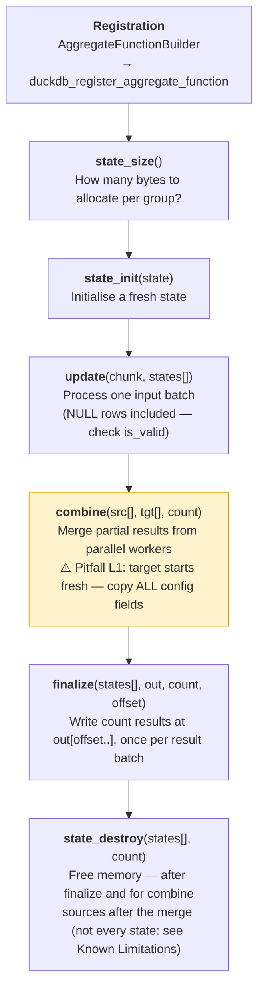

# Aggregate Functions

This page shows how to write a DuckDB aggregate function in Rust with quack-rs:
the callbacks DuckDB calls, their signatures, and how `AggregateFunctionBuilder`
registers them. An aggregate function reduces many rows to one value per group,
like `SUM()`, `COUNT()` or `AVG()`. Because DuckDB aggregates in parallel, it
also has a `combine` step that merges partial results from parallel workers.

## Known DuckDB limitation

> **Out-of-bounds state reads.** Two query shapes make
> DuckDB call every C-API aggregate's `update` with a state array holding **one**
> state while passing `count > 1` rows, so the callback reads `states[1..count]`
> past the end of the array (undefined behaviour, in any C-API aggregate, whether
> built with quack-rs or by hand):
>
> - **Window aggregates whose frame is the whole partition**, e.g. `agg(x) OVER ()`
>   — `WindowConstantAggregator` (`src/function/window/window_constant_aggregator.cpp`,
>   ~lines 106 and 296–299 in DuckDB 1.5.5).
> - **Ordered aggregates**, e.g. `agg(x ORDER BY y)` —
>   `src/function/aggregate/sorted_aggregate_function.cpp`, ~lines 630–633.
>
> Both paths pass a `CONSTANT_VECTOR` of states because the function has no
> `simple_update` (which the C API cannot set), and `CAPIAggregateUpdate`
> (`src/main/capi/aggregate_function-c.cpp`, ~lines 92–110) passes the vector's
> data pointer to the extension without flattening it. This is a defect in
> DuckDB's C API, not in quack-rs, and it cannot be detected from inside the
> callback: reading `states[1]` to check is itself the out-of-bounds read. Until
> DuckDB fixes it, do not use C-API aggregates in those two query shapes.
>
> Reported upstream as [duckdb/duckdb#26109](https://github.com/duckdb/duckdb/issues/26109).

---

## The aggregate lifecycle


```mermaid
flowchart TD
    REG["<b>Registration</b><br/>AggregateFunctionBuilder<br/>→ duckdb_register_aggregate_function"]

    REG     --> SIZE
    SIZE    --> INIT
    INIT    --> UPDATE
    UPDATE  --> COMBINE
    COMBINE --> FINAL
    FINAL   --> DESTROY

    SIZE["<b>state_size</b>()<br/>How many bytes to allocate per group?"]
    INIT["<b>state_init</b>(state)<br/>Initialise a fresh state"]
    UPDATE["<b>update</b>(chunk, states[])<br/>Process one input batch<br/>(NULL rows included — check is_valid)"]
    COMBINE["<b>combine</b>(src[], tgt[], count)<br/>Merge partial results from parallel workers<br/>⚠️ Pitfall L1: target starts fresh — copy ALL config fields"]
    FINAL["<b>finalize</b>(states[], out, count, offset)<br/>Write count results at out[offset..], once per result batch"]
    DESTROY["<b>state_destroy</b>(states[], count)<br/>Free memory — after finalize and for combine<br/>sources after the merge (not every state: see Known Limitations)"]

    style COMBINE fill:#fff3cd,stroke:#e6ac00,color:#333
```

DuckDB may call `combine` many times as it merges partial results. **A `combine`
target holds whatever `state_init` set up**, not a copy of the source, so `combine`
must carry every field across (Pitfall L1). `state_size` is called whenever an
operator sizes its state buffers, not once at registration, so it must always
return the same value. `destroy` runs after `finalize`, and on `combine`'s source
states once they have been merged.

**`combine` must leave its source states unchanged**
([Pitfall L15](../reference/pitfalls.md#l15-combine-must-leave-its-source-states-unchanged)).
A window's segment tree combines the same state into every frame that covers it,
from several threads at once. A `combine` that moves data out of its source
(`mem::take`, or zeroing a counter) is right for the first frame and wrong for the
rest: in quack-rs's regression test, a sliding-window sum written that way was
wrong on 4985 of 5000 rows. Read the source and copy or clone what the target
needs.

---

## Registration

```rust
# use libduckdb_sys::{duckdb_aggregate_state, duckdb_bind_info, duckdb_connection,
#     duckdb_data_chunk, duckdb_function_info, duckdb_init_info, duckdb_vector, idx_t};
# use quack_rs::prelude::*;
# #[derive(Default)] struct MyState { count: i64 }
# impl AggregateState for MyState {}
# unsafe extern "C" fn update(_: duckdb_function_info, _: duckdb_data_chunk, _: *mut duckdb_aggregate_state) {}
# unsafe extern "C" fn combine(_: duckdb_function_info, _: *mut duckdb_aggregate_state, _: *mut duckdb_aggregate_state, _: idx_t) {}
# unsafe extern "C" fn finalize(_: duckdb_function_info, _: *mut duckdb_aggregate_state, _: duckdb_vector, _: idx_t, _: idx_t) {}
use quack_rs::aggregate::AggregateFunctionBuilder;
use quack_rs::types::TypeId;

unsafe fn register(con: duckdb_connection) -> Result<(), ExtensionError> {
    unsafe {
        AggregateFunctionBuilder::new("my_agg")
            .param(TypeId::BigInt)        // input type(s)
            .returns(TypeId::BigInt)      // output type
            .ffi_state::<MyState>()       // state_size + init + destructor
            .update(update)
            .combine(combine)
            .finalize(finalize)
            .register(con)?;
    }
    Ok(())
}
```

`register` returns an error if the return type or any of the five required
callbacks (`state_size`, `init`, `update`, `combine`, `finalize`) is missing. The
builder treats the `destructor` as optional (without one, `register` installs a
no-op destructor; see
[Pitfall L13](../reference/pitfalls.md#l13-a-c-api-aggregate-without-a-destructor-is-wrong-in-a-running-window)),
but `FfiState<T>` needs its `destroy_callback` to drop each `T`.
`.ffi_state::<MyState>()` sets `state_size`, `init` and `destructor` together from
`FfiState<MyState>`, so the three cannot describe different states; see
[State Management](aggregate-state.md#wiring-them-up-ffi_statet). `update`,
`combine` and `finalize` read the state through `FfiState::<MyState>::with_state` /
`with_state_mut` with the same type.

---

## Callback signatures

With `FfiState<T>` you do not write `state_size`, `init` or `destroy` yourself:
`ffi_state::<T>()` installs `FfiState::<T>::size_callback`, `init_callback` and
`destroy_callback`. The wrappers below show the signature DuckDB calls each one
with, and what it does. `update`, `combine` and `finalize` are yours to write.

### `state_size`

```rust
# use libduckdb_sys::{duckdb_aggregate_state, duckdb_bind_info, duckdb_connection,
#     duckdb_data_chunk, duckdb_function_info, duckdb_init_info, duckdb_vector, idx_t};
# use quack_rs::prelude::*;
# #[derive(Default)] struct MyState { config_field: i64, accumulator: i64 }
# impl MyState {
#     fn accumulate(&mut self, v: i64) { self.accumulator += v; }
#     fn result(&self) -> i64 { self.accumulator }
# }
# impl AggregateState for MyState {}
unsafe extern "C" fn state_size(info: duckdb_function_info) -> idx_t {
    unsafe { FfiState::<MyState>::size_callback(info) }
}
```

Returns the number of bytes DuckDB allocates per group, `FfiState::<MyState>::size()`:
a tag word followed by `MyState` itself, padded to whole words (or, for a state
larger than 256 bytes or aligned more strictly than `usize`, a `Box<MyState>`
pointer).

### `state_init`

```rust
# use libduckdb_sys::{duckdb_aggregate_state, duckdb_bind_info, duckdb_connection,
#     duckdb_data_chunk, duckdb_function_info, duckdb_init_info, duckdb_vector, idx_t};
# use quack_rs::prelude::*;
# #[derive(Default)] struct MyState { config_field: i64, accumulator: i64 }
# impl MyState {
#     fn accumulate(&mut self, v: i64) { self.accumulator += v; }
#     fn result(&self) -> i64 { self.accumulator }
# }
# impl AggregateState for MyState {}
unsafe extern "C" fn state_init(info: duckdb_function_info, state: duckdb_aggregate_state) {
    unsafe { FfiState::<MyState>::init_callback(info, state) };
}
```

Writes `MyState::default()` into the DuckDB-allocated state slot (or, for a boxed
state, a `Box` holding it), then writes the tag that marks the slot initialised. A
panic in `default()` is caught and reported to DuckDB as a query error.

### `update`

```rust
# use libduckdb_sys::{duckdb_aggregate_state, duckdb_bind_info, duckdb_connection,
#     duckdb_data_chunk, duckdb_function_info, duckdb_init_info, duckdb_vector, idx_t};
# use quack_rs::prelude::*;
# #[derive(Default)] struct MyState { config_field: i64, accumulator: i64 }
# impl MyState {
#     fn accumulate(&mut self, v: i64) { self.accumulator += v; }
#     fn result(&self) -> i64 { self.accumulator }
# }
# impl AggregateState for MyState {}
unsafe extern "C" fn update(
    _info: duckdb_function_info,
    input: duckdb_data_chunk,
    states: *mut duckdb_aggregate_state,
) {
    let reader = unsafe { VectorReader::new(input, 0) };
    let row_count = reader.row_count();

    for row in 0..row_count {
        if unsafe { !reader.is_valid(row) } { continue; }
        let value = unsafe { reader.read_i64(row) };

        let state_ptr = unsafe { *states.add(row) };
        if let Some(st) = unsafe { FfiState::<MyState>::with_state_mut(state_ptr) } {
            st.accumulate(value);
        }
    }
}
```

`states[row]` is the state of that row's group; rows in the same group share one
state. `update` receives NULL rows too, so skip rows where `is_valid` is false (see
[NULL Handling](null-handling.md#aggregate-functions)).

### `combine`

```rust
# use libduckdb_sys::{duckdb_aggregate_state, duckdb_bind_info, duckdb_connection,
#     duckdb_data_chunk, duckdb_function_info, duckdb_init_info, duckdb_vector, idx_t};
# use quack_rs::prelude::*;
# #[derive(Default)] struct MyState { config_field: i64, accumulator: i64 }
# impl MyState {
#     fn accumulate(&mut self, v: i64) { self.accumulator += v; }
#     fn result(&self) -> i64 { self.accumulator }
# }
# impl AggregateState for MyState {}
unsafe extern "C" fn combine(
    _info: duckdb_function_info,
    source: *mut duckdb_aggregate_state,
    target: *mut duckdb_aggregate_state,
    count: idx_t,
) {
    for i in 0..count as usize {
        let src = unsafe { FfiState::<MyState>::with_state(*source.add(i)) };
        let tgt = unsafe { FfiState::<MyState>::with_state_mut(*target.add(i)) };
        if let (Some(s), Some(t)) = (src, tgt) {
            // ⚠️  MUST copy ALL fields — see Pitfall L1
            t.config_field = s.config_field;   // configuration
            t.accumulator  += s.accumulator;    // data
        }
    }
}
```

> **Pitfall L1 — critical**: Target states are fresh states, set up by `state_init`
> (with `FfiState<T>::init_callback`, a `T::default()`), not copies of the source.
> You must copy **every** field, including configuration fields set during `update`.
> Forgetting even one config field produces silently wrong results.
> See [Pitfall L1](../reference/pitfalls.md#l1-combine-must-propagate-all-config-fields).

### `finalize`

```rust
# use libduckdb_sys::{duckdb_aggregate_state, duckdb_bind_info, duckdb_connection,
#     duckdb_data_chunk, duckdb_function_info, duckdb_init_info, duckdb_vector, idx_t};
# use quack_rs::prelude::*;
# #[derive(Default)] struct MyState { config_field: i64, accumulator: i64 }
# impl MyState {
#     fn accumulate(&mut self, v: i64) { self.accumulator += v; }
#     fn result(&self) -> i64 { self.accumulator }
# }
# impl AggregateState for MyState {}
unsafe extern "C" fn finalize(
    _info: duckdb_function_info,
    source: *mut duckdb_aggregate_state,
    result: duckdb_vector,
    count: idx_t,
    offset: idx_t,
) {
    let mut writer = unsafe { VectorWriter::new(result) };
    for i in 0..count as usize {
        let state_ptr = unsafe { *source.add(i) };
        match unsafe { FfiState::<MyState>::with_state(state_ptr) } {
            Some(st) => unsafe { writer.write_i64(offset as usize + i, st.result()) },
            None     => unsafe { writer.set_null(offset as usize + i) },
        }
    }
}
```

`offset` is non-zero when DuckDB writes the results into part of a larger vector.
Always add it to the output index.

### `state_destroy`

```rust
# use libduckdb_sys::{duckdb_aggregate_state, duckdb_bind_info, duckdb_connection,
#     duckdb_data_chunk, duckdb_function_info, duckdb_init_info, duckdb_vector, idx_t};
# use quack_rs::prelude::*;
# #[derive(Default)] struct MyState { config_field: i64, accumulator: i64 }
# impl AggregateState for MyState {}
unsafe extern "C" fn state_destroy(states: *mut duckdb_aggregate_state, count: idx_t) {
    unsafe { FfiState::<MyState>::destroy_callback(states, count) };
}
```

`destroy_callback` drops the `T` in each state whose tag matches (freeing its box,
if `T` is boxed), clearing the tag first, so a second call on the same state is a
no-op. See [Pitfall L2](../reference/pitfalls.md#l2-state-destroy-double-free).

---

## Complex parameter and return types

For functions that accept or return parameterized types like `LIST(BIGINT)`,
`MAP(VARCHAR, INTEGER)`, or `STRUCT(...)`, use `param_logical` and
`returns_logical` instead of `param` and `returns`:

```rust
# use libduckdb_sys::{duckdb_aggregate_state, duckdb_bind_info, duckdb_connection,
#     duckdb_data_chunk, duckdb_function_info, duckdb_init_info, duckdb_vector, idx_t};
# use quack_rs::prelude::*;
# #[derive(Default)] struct MyState { count: i64 }
# impl AggregateState for MyState {}
# unsafe extern "C" fn update(_: duckdb_function_info, _: duckdb_data_chunk, _: *mut duckdb_aggregate_state) {}
# unsafe extern "C" fn combine(_: duckdb_function_info, _: *mut duckdb_aggregate_state, _: *mut duckdb_aggregate_state, _: idx_t) {}
# unsafe extern "C" fn finalize(_: duckdb_function_info, _: *mut duckdb_aggregate_state, _: duckdb_vector, _: idx_t, _: idx_t) {}
use quack_rs::aggregate::AggregateFunctionBuilder;
use quack_rs::types::{LogicalType, TypeId};

unsafe fn register(con: duckdb_connection) -> Result<(), ExtensionError> {
    unsafe {
        AggregateFunctionBuilder::new("retention")
            .param(TypeId::Boolean)
            .param(TypeId::Boolean)
            .returns_logical(LogicalType::list(TypeId::Boolean))  // LIST(BOOLEAN)
            .ffi_state::<MyState>()                                // state_size + init + destructor
            .update(update)
            .combine(combine)
            .finalize(finalize)
            .register(con)?;
    }
    Ok(())
}
```

`param_logical` and `param` can be interleaved — the parameter position is
determined by the total number of calls made so far:

```rust
# use libduckdb_sys::{duckdb_aggregate_state, duckdb_bind_info, duckdb_connection,
#     duckdb_data_chunk, duckdb_function_info, duckdb_init_info, duckdb_vector, idx_t};
# use quack_rs::prelude::*;
# fn demo() {
# let _ =
AggregateFunctionBuilder::new("my_func")
    .param(TypeId::Varchar)                          // position 0: VARCHAR
    .param_logical(LogicalType::list(TypeId::BigInt)) // position 1: LIST(BIGINT)
    .param(TypeId::Integer)                           // position 2: INTEGER
    .returns(TypeId::BigInt)
    // ...
# ;
# }
```

If both `returns` and `returns_logical` are called, the logical type takes precedence.

---

## Extra info

`extra_info` attaches arbitrary data to an aggregate function, for example
configuration that parameterises its behaviour. DuckDB calls the destroy callback
to free the data when the function is dropped:

```rust
# use libduckdb_sys::{duckdb_aggregate_state, duckdb_bind_info, duckdb_connection,
#     duckdb_data_chunk, duckdb_function_info, duckdb_init_info, duckdb_vector, idx_t};
# use quack_rs::prelude::*;
# #[derive(Default)] struct MyState { count: i64 }
# impl AggregateState for MyState {}
# unsafe extern "C" fn update(_: duckdb_function_info, _: duckdb_data_chunk, _: *mut duckdb_aggregate_state) {}
# unsafe extern "C" fn combine(_: duckdb_function_info, _: *mut duckdb_aggregate_state, _: *mut duckdb_aggregate_state, _: idx_t) {}
# unsafe extern "C" fn finalize(_: duckdb_function_info, _: *mut duckdb_aggregate_state, _: duckdb_vector, _: idx_t, _: idx_t) {}
# unsafe extern "C" fn my_destroy(p: *mut std::os::raw::c_void) {
#     drop(unsafe { Box::from_raw(p.cast::<u64>()) });
# }
# unsafe fn demo(con: duckdb_connection) -> Result<(), ExtensionError> {
use std::os::raw::c_void;

let config = Box::into_raw(Box::new(42u64)).cast::<c_void>();
unsafe {
    AggregateFunctionBuilder::new("my_agg")
        .param(TypeId::BigInt)
        .returns(TypeId::BigInt)
        .extra_info(config, Some(my_destroy))
        .ffi_state::<MyState>()  // state_size + init + destructor
        .update(update)
        .combine(combine)
        .finalize(finalize)
        .register(con)?;
}
# Ok(())
# }
```

Inside callbacks, retrieve the extra info with `AggregateFunctionInfo::get_extra_info()`.

---

## `AggregateFunctionInfo`

`AggregateFunctionInfo` wraps the `duckdb_function_info` handle that DuckDB passes
to every aggregate callback except the destructor. It exposes:

- `get_extra_info() -> *mut c_void`: the extra-info pointer set at registration.
- `set_error(message)`: fails the current query with `message`. Called from
  `finalize`, it also leaves some states undestroyed; see
  [Known Limitations](../reference/known-limitations.md#aggregate-states-leak-when-finalize-reports-an-error-duckdb-behaviour).

```rust
# use libduckdb_sys::{duckdb_aggregate_state, duckdb_bind_info, duckdb_connection,
#     duckdb_data_chunk, duckdb_function_info, duckdb_init_info, duckdb_vector, idx_t};
# use quack_rs::prelude::*;
use quack_rs::aggregate::AggregateFunctionInfo;

unsafe extern "C" fn update(
    info: duckdb_function_info,
    input: duckdb_data_chunk,
    states: *mut duckdb_aggregate_state,
) {
    let info = unsafe { AggregateFunctionInfo::new(info) };
    let extra = unsafe { info.get_extra_info() };
    // ... use extra info, or report errors via info.set_error("...") ...
}
```

---

## Next steps

- [State Management](aggregate-state.md) — `FfiState<T>`, `AggregateState`, and lifecycle details
- [Overloading with Function Sets](aggregate-sets.md) — register multiple signatures under one name
