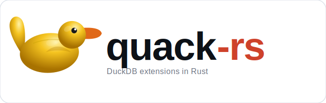
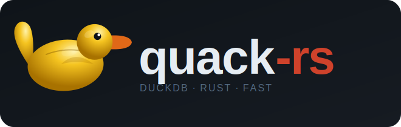

  
  

**The Rust SDK for building DuckDB loadable extensions — no C++ required.**

---

## What is quack-rs?

`quack-rs` is a production-grade Rust SDK that makes building [DuckDB](https://duckdb.org/)
loadable extensions straightforward and safe. It wraps the DuckDB C Extension API — the same
API used by official DuckDB extensions — and eliminates every known FFI pitfall so you can
focus on writing extension logic in pure Rust.

DuckDB's own documentation acknowledges the gap:

> *"Writing a Rust-based DuckDB extension requires writing glue code in C++ and will force you
> to build through DuckDB's CMake & C++ based extension template. We understand that this is not
> ideal and acknowledge the fact that Rust developers prefer to work on pure Rust codebases."*
>
> — [DuckDB Community Extensions FAQ](https://duckdb.org/community_extensions/faq#can-i-write-extensions-in-rust)

**quack-rs closes that gap.** No C++. No CMake. No glue code.

---

## What you can build

| Extension type | quack-rs support |
|----------------|-----------------|
| Scalar functions | ✅ `ScalarFunctionBuilder` |
| Overloaded scalars | ✅ `ScalarFunctionSetBuilder` |
| Aggregate functions | ✅ `AggregateFunctionBuilder` |
| Overloaded aggregates | ✅ `AggregateFunctionSetBuilder` |
| Table functions | ✅ `TableFunctionBuilder` |
| Cast / TRY\_CAST functions | ✅ `CastFunctionBuilder` |
| Replacement scans | ✅ `ReplacementScanBuilder` |
| SQL macros (scalar) | ✅ `SqlMacro::scalar` |
| SQL macros (table) | ✅ `SqlMacro::table` |

> **Note:** Window functions and COPY format handlers have no counterpart in DuckDB's
> public C Extension API and cannot be implemented from Rust (or any language) via that
> API. See [Known Limitations](reference/known-limitations.md).

---

## Why does this exist?

`quack-rs` was extracted from
[duckdb-behavioral](https://github.com/tomtom215/duckdb-behavioral), a production DuckDB
community extension. Building that extension revealed **15 undocumented pitfalls** in DuckDB's
Rust FFI surface — struct layouts, callback contracts, and initialization sequences that
aren't covered anywhere in the DuckDB documentation or `libduckdb-sys` docs.

Three of those pitfalls caused extension-breaking bugs that passed 435 unit tests before
being caught by end-to-end tests:

1. A SEGFAULT on load (wrong entry point sequence)
2. 6 of 7 functions silently not registered (undocumented function-set naming rule)
3. Wrong aggregate results under parallel plans (combine callback not propagating configuration fields to fresh target states)

`quack-rs` makes each of these impossible through type-safe builders and safe wrappers.
The full catalog is documented in the [Pitfall Reference](reference/pitfalls.md).

---

## Key features

- **Zero C++** — no `CMakeLists.txt`, no header files, no glue code
- **All C API function types** — scalar, aggregate, table, cast, replacement scan, SQL macro
- **Panic-free FFI** — `init_extension` never panics; errors surface via `Result`
- **RAII memory management** — `LogicalType` and `FfiState<T>` prevent leaks and double-frees
- **Type-safe builders** — `ScalarFunctionBuilder`, `AggregateFunctionBuilder`, `TableFunctionBuilder`, `CastFunctionBuilder`, `ReplacementScanBuilder`
- **SQL macros** — register `CREATE MACRO` statements without any FFI callbacks
- **Testable state** — `AggregateTestHarness<T>` tests aggregate logic without a live DuckDB
- **Scaffold generator** — produces a submission-ready community extension project from code
- **15 pitfalls documented** — every known DuckDB Rust FFI pitfall, with symptoms and fixes

---

## Navigation

New to DuckDB extensions?
→ Start with **[Quick Start](getting-started/quick-start.md)**

Adding quack-rs to an existing project?
→ See **[Installation](getting-started/installation.md)**

Writing your first function?
→ See **[Scalar Functions](functions/scalar.md)** or **[Aggregate Functions](functions/aggregate.md)**

Want SQL macros without FFI callbacks?
→ See **[SQL Macros](functions/sql-macros.md)**

Submitting a community extension?
→ See **[Community Extensions](publishing.md)**

Something broke?
→ See **[Pitfall Catalog](reference/pitfalls.md)**
