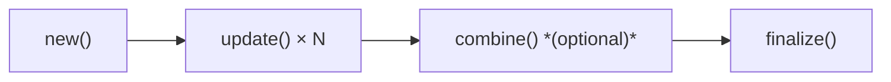

# Testing Guide

quack-rs provides a two-tier testing strategy: **pure-Rust unit tests** for
business logic (no DuckDB required), and **SQLLogicTest E2E tests** that run
inside an actual DuckDB process.

---

## Architectural limitation: the `loadable-extension` dispatch wall

This is the most important thing to understand before writing tests.

`DuckDB` loadable extensions use `libduckdb-sys` with
`features = ["loadable-extension"]`. This intentionally **does not link the
DuckDB runtime** into the extension binary. Instead, every DuckDB C API call
(`duckdb_vector_get_data`, `duckdb_create_logical_type`, etc.) goes through a
lazy dispatch table — a global struct of `AtomicPtr<fn>` pointers initialized
only when DuckDB calls `duckdb_rs_extension_api_init` at extension-load time.

**In `cargo test`, no DuckDB process loads your extension.** The dispatch table
is never initialized, and the first call to any DuckDB C API function panics:

```text
DuckDB API not initialized
```

### What this breaks

| API | Why it fails |
|-----|--------------|
| `VectorReader::new` | calls `duckdb_vector_get_data` |
| `VectorWriter::new` | calls `duckdb_vector_get_data` |
| `Connection::register_*` | calls DuckDB registration C API |
| `LogicalType::new` | calls `duckdb_create_logical_type` |
| `LogicalType::drop` | calls `duckdb_destroy_logical_type` |
| `BindInfo::add_result_column` | calls `duckdb_bind_add_result_column` |

### What still works in `cargo test`

| API | Why it works |
|-----|--------------|
| `AggregateTestHarness` | pure Rust, zero DuckDB dependency |
| `MockVectorWriter` / `MockVectorReader` | in-memory buffers, zero DuckDB dependency |
| `MockRegistrar` | records registrations without calling C API |
| `SqlMacro::to_sql()` | generates SQL strings, no DuckDB needed |
| `interval_to_micros` | pure arithmetic |
| `validate` / `scaffold` | pure Rust |
| `InMemoryDb` | uses bundled DuckDB via `duckdb` crate (`bundled-test` feature) |

---

## Mock types for callback logic

When your scalar or table function callback reads inputs and writes outputs,
extract that logic into a pure-Rust function. Then test it with
`MockVectorReader` (input) and `MockVectorWriter` (output):

```rust
use quack_rs::testing::{MockVectorReader, MockVectorWriter};

// Pure Rust logic — extracted from the FFI callback
fn compute_upper(reader: &MockVectorReader, writer: &mut MockVectorWriter) {
    for i in 0..reader.row_count() {
        if reader.is_valid(i) {
            let s = reader.try_get_str(i).unwrap_or("");
            writer.write_varchar(i, &s.to_uppercase());
        } else {
            writer.set_null(i);
        }
    }
}

#[test]
fn test_compute_upper() {
    let reader = MockVectorReader::from_strs([Some("hello"), None, Some("world")]);
    let mut writer = MockVectorWriter::new(3);
    compute_upper(&reader, &mut writer);

    assert_eq!(writer.try_get_str(0), Some("HELLO"));
    assert!(writer.is_null(1));
    assert_eq!(writer.try_get_str(2), Some("WORLD"));
}
```

The real FFI callback becomes a thin wrapper:

```rust,no_run
unsafe extern "C" fn my_scalar(
    _info: duckdb_function_info,
    input: duckdb_data_chunk,
    output: duckdb_vector,
) {
    // Real DuckDB wrappers — only used in production, not in cargo test
    let reader = unsafe { VectorReader::new(input, 0) };
    let mut writer = unsafe { VectorWriter::new(output) };
    // TODO: adapt mock-compatible logic to real readers/writers
}
```

---

## Testing registration with `MockRegistrar`

`MockRegistrar` implements the `Registrar` trait without calling any DuckDB C API.
Use it to verify your registration function registers the right set of functions:

```rust
use quack_rs::connection::Registrar;
use quack_rs::testing::MockRegistrar;
use quack_rs::scalar::ScalarFunctionBuilder;
use quack_rs::types::TypeId;
use quack_rs::error::ExtensionError;

fn register_all(reg: &impl Registrar) -> Result<(), ExtensionError> {
    let upper = ScalarFunctionBuilder::new("upper_ext")
        .param(TypeId::Varchar)
        .returns(TypeId::Varchar);
    let lower = ScalarFunctionBuilder::new("lower_ext")
        .param(TypeId::Varchar)
        .returns(TypeId::Varchar);
    unsafe {
        reg.register_scalar(upper)?;
        reg.register_scalar(lower)?;
    }
    Ok(())
}

#[test]
fn test_register_all() {
    let mock = MockRegistrar::new();
    register_all(&mock).unwrap();
    assert_eq!(mock.total_registrations(), 2);
    assert!(mock.has_scalar("upper_ext"));
    assert!(mock.has_scalar("lower_ext"));
}
```

> **Limitation**: `MockRegistrar` cannot be used with builders that hold
> `LogicalType` values (created via `.returns_logical()` or `.param_logical()`),
> because `LogicalType::drop` calls `duckdb_destroy_logical_type`. Use `TypeId`
> parameters with `MockRegistrar`.

---

## SQL-level testing with `InMemoryDb` (`bundled-test` feature)

For SQL-level assertions — verifying that a SQL macro produces the correct output,
or that a CREATE TABLE + INSERT + SELECT pipeline works — enable the `bundled-test`
Cargo feature. This provides `InMemoryDb`, which wraps the `duckdb` crate's bundled
DuckDB without going through the `loadable-extension` dispatch:

```toml
# In your extension's Cargo.toml
[dev-dependencies]
quack-rs = { version = "0.5", features = ["bundled-test"] }
```

```rust,no_run
# #[cfg(feature = "bundled-test")]
use quack_rs::testing::InMemoryDb;
use quack_rs::sql_macro::SqlMacro;

#[test]
fn test_clamp_macro_sql() {
    let db = InMemoryDb::open().unwrap();

    // Generate and execute the CREATE MACRO SQL
    let m = SqlMacro::scalar("clamp", &["x", "lo", "hi"], "greatest(lo, least(hi, x))").unwrap();
    db.execute_batch(&m.to_sql()).unwrap();

    // Verify correct output
    let result: i64 = db.query_one("SELECT clamp(5, 1, 10)").unwrap();
    assert_eq!(result, 5);

    let clamped: i64 = db.query_one("SELECT clamp(15, 1, 10)").unwrap();
    assert_eq!(clamped, 10);
}
```

> **Note**: `InMemoryDb` cannot test your FFI callbacks (`VectorReader`,
> `VectorWriter`) because those still route through the `loadable-extension`
> dispatch. Use `InMemoryDb` for SQL logic and mocks for callback logic.

---

## Why two tiers?

> **Pitfall P3** — Unit tests are insufficient. 435 unit tests passed in
> duckdb-behavioral while the extension had three critical bugs: a SEGFAULT on
> load, 6 of 7 functions not registering, and wrong results from a combine bug.
> E2E tests caught all three.

| Test tier | What it catches | What it misses |
|-----------|-----------------|----------------|
| Unit tests | Logic bugs in state structs | FFI wiring, registration failures, SEGFAULT |
| E2E tests | Everything above + FFI integration | Nothing (it's real DuckDB) |

**Both tiers are required.** Unit tests give fast, deterministic feedback.
E2E tests prove the extension actually works inside DuckDB.

---

## Unit tests with `AggregateTestHarness`

`AggregateTestHarness<S>` simulates the DuckDB aggregate lifecycle in pure Rust
without any DuckDB dependency:



### Basic usage

```rust
use quack_rs::testing::AggregateTestHarness;
use quack_rs::aggregate::AggregateState;

#[derive(Default, Debug, PartialEq)]
struct SumState { total: i64 }
impl AggregateState for SumState {}

#[test]
fn test_sum() {
    let mut h = AggregateTestHarness::<SumState>::new();
    h.update(|s| s.total += 10);
    h.update(|s| s.total += 20);
    h.update(|s| s.total += 5);
    assert_eq!(h.finalize().total, 35);
}
```

### Convenience: `aggregate`

For testing over a collection of inputs:

```rust
#[test]
fn test_word_count() {
    let result = AggregateTestHarness::<WordCountState>::aggregate(
        ["hello world", "one", "two three four", ""],
        |s, text| s.count += count_words(text),
    );
    assert_eq!(result.count, 6);  // 2 + 1 + 3 + 0
}
```

### Testing `combine` (Pitfall L1)

DuckDB creates fresh zero-initialized target states and calls `combine` to merge
into them. You MUST propagate ALL fields — including configuration fields —
not just accumulated data. Test this explicitly:

```rust
#[test]
fn combine_propagates_config() {
    let mut h1 = AggregateTestHarness::<MyState>::new();
    h1.update(|s| {
        s.window_size = 3600;  // config field
        s.count += 5;          // data field
    });

    // h2 simulates a fresh zero-initialized state created by DuckDB
    let mut h2 = AggregateTestHarness::<MyState>::new();

    h2.combine(&h1, |src, tgt| {
        tgt.window_size = src.window_size;  // MUST propagate config
        tgt.count += src.count;
    });

    let result = h2.finalize();
    assert_eq!(result.window_size, 3600);  // Would be 0 if forgotten
    assert_eq!(result.count, 5);
}
```

### Inspecting intermediate state

```rust
let mut h = AggregateTestHarness::<SumState>::new();
h.update(|s| s.total += 5);
assert_eq!(h.state().total, 5);   // borrow without consuming
h.update(|s| s.total += 3);
assert_eq!(h.state().total, 8);
```

### Resetting

```rust
let mut h = AggregateTestHarness::<SumState>::new();
h.update(|s| s.total = 999);
h.reset();
assert_eq!(h.state().total, 0);  // back to S::default()
```

### Pre-populating state

```rust
let initial = MyState { window_size: 3600, count: 0 };
let h = AggregateTestHarness::with_state(initial);
```

---

## Unit tests for scalar functions

Scalar logic is pure Rust — test it directly:

```rust
// From examples/hello-ext/src/lib.rs — scalar function logic
pub fn first_word(s: &str) -> &str {
    s.split_whitespace().next().unwrap_or("")
}

#[test]
fn first_word_basic() {
    assert_eq!(first_word("hello world"), "hello");
    assert_eq!(first_word("  padded  "), "padded");
    assert_eq!(first_word(""), "");
    assert_eq!(first_word("   "), "");
}
```

---

## Unit tests for SQL macros

`SqlMacro::to_sql()` is pure Rust — no DuckDB connection needed:

```rust
use quack_rs::sql_macro::SqlMacro;

#[test]
fn scalar_macro_sql() {
    let m = SqlMacro::scalar("double_it", &["x"], "x * 2").unwrap();
    assert_eq!(m.to_sql(),
        "CREATE OR REPLACE MACRO double_it(x) AS (x * 2)");
}

#[test]
fn table_macro_sql() {
    let m = SqlMacro::table("recent", &["n"], "SELECT * FROM events LIMIT n").unwrap();
    assert_eq!(m.to_sql(),
        "CREATE OR REPLACE MACRO recent(n) AS TABLE SELECT * FROM events LIMIT n");
}
```

---

## E2E testing with SQLLogicTest

Community extensions are tested using DuckDB's
[SQLLogicTest](https://duckdb.org/docs/dev/sqllogictest/intro.html) format. This
format runs SQL directly in DuckDB and verifies output line-by-line.

### File location

```
test/sql/my_extension.test
```

### Format

```sql
# my_extension tests

require my_extension

statement ok
LOAD my_extension;

query I
SELECT my_function('hello world');
----
2
```

Directives:

| Directive | Meaning |
|-----------|---------|
| `require` | Skip test if extension not available |
| `statement ok` | SQL must succeed |
| `statement error` | SQL must fail |
| `query I` | Query returning one INTEGER column |
| `query II` | Query returning two columns |
| `query T` | Query returning one TEXT column |
| `----` | Expected output follows |

### Installing DuckDB (1.4.4 or 1.5.0)

A live DuckDB CLI is **required** for E2E testing. Install it via `curl`
(no system package manager needed). Either DuckDB 1.4.4 or 1.5.0 works —
both use the same C API version (`v1.2.0`):

```bash
# DuckDB 1.5.0 (latest)
curl -fsSL https://github.com/duckdb/duckdb/releases/download/v1.5.0/duckdb_cli-linux-amd64.zip \
    -o /tmp/duckdb.zip \
    && unzip -o /tmp/duckdb.zip -d /tmp/ \
    && chmod +x /tmp/duckdb \
    && /tmp/duckdb --version
# → v1.5.0
```

For macOS, replace `linux-amd64` with `osx-universal`. For Windows, use
`windows-amd64` and unzip to a directory on `%PATH%`.

### Running E2E tests

```bash
# Build the extension
cargo build --release

# Package with metadata footer (required by DuckDB's extension loader)
cargo run --bin append_metadata -- \
    target/release/libmy_extension.so \
    /tmp/my_extension.duckdb_extension \
    --abi-type C_STRUCT \
    --extension-version v0.1.0 \
    --duckdb-version v1.2.0 \
    --platform linux_amd64

# Load it in DuckDB CLI (-unsigned allows loading without a signed certificate)
/tmp/duckdb -unsigned -c "
SET allow_extensions_metadata_mismatch=true;
LOAD '/tmp/my_extension.duckdb_extension';
SELECT my_function('hello world');
"
```

The community extension CI runs SQLLogicTest automatically. Each function must
have at least one test:

```sql
# Test NULL handling
query I
SELECT my_function(NULL);
----
NULL

# Test empty input
query I
SELECT my_function('');
----
0

# Test normal case
query I
SELECT my_function('hello world');
----
2
```

> **Pitfall P5** — SQLLogicTest does exact string matching. Copy expected values
> directly from DuckDB CLI output. NULL is represented as `NULL` (uppercase).
> Floats must match to the number of decimal places DuckDB outputs.

---

## Property-based testing with `proptest`

The `proptest` crate is well-suited for testing aggregate logic over arbitrary
inputs:

```rust
use proptest::prelude::*;

proptest! {
    #[test]
    fn saturating_never_panics(months: i32, days: i32, micros: i64) {
        let iv = DuckInterval { months, days, micros };
        // Must not panic for any input
        let _ = interval_to_micros_saturating(iv);
    }
}
```

quack-rs's own test suite uses proptest for interval conversion and aggregate
harness properties.

---

## What to test

| Scenario | Unit | E2E |
|----------|------|-----|
| NULL input → NULL output | | ✓ |
| Empty string | ✓ | ✓ |
| Unicode strings | ✓ | |
| Numeric edge cases (0, MAX, MIN) | ✓ | |
| Combine propagates config | ✓ | |
| Multi-group aggregation | | ✓ |
| Function registration success | | ✓ |
| Extension loads without crash | | ✓ |
| SQL macro produces correct output | ✓ (to_sql) | ✓ |

---

## Dev dependencies

```toml
[dev-dependencies]
quack-rs = { version = "0.5", features = [] }
proptest = "1"
```

The `testing` module is compiled unconditionally (not `#[cfg(test)]`) so it is
available as a dev-dependency to downstream crates.
