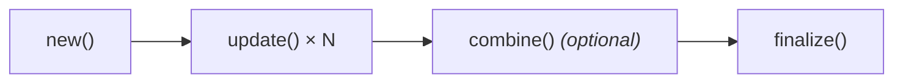

# Testing Guide

This page covers how to test a DuckDB extension written with quack-rs. The
strategy has two tiers: **pure-Rust unit tests** for business logic (no DuckDB
required), and **SQLLogicTest end-to-end (E2E) tests** that load the packaged
extension into a real DuckDB process. Between the two, the `InMemoryDb` helper
lets `cargo test` register and call your real callbacks against a bundled DuckDB.

---

## Architectural limitation: the `loadable-extension` dispatch wall

This is the most important thing to understand before writing tests.

DuckDB loadable extensions use `libduckdb-sys` with
`features = ["loadable-extension"]`. This intentionally **does not link the
DuckDB runtime** into the extension binary. Instead, every DuckDB C API call
(`duckdb_vector_get_data`, `duckdb_create_logical_type`, etc.) goes through a
dispatch table: one global `AtomicPtr` per C API function, filled in only when
the extension's entry point calls `duckdb_rs_extension_api_init` as DuckDB
loads it.

**In `cargo test`, no DuckDB process loads your extension.** The dispatch table
is never initialized, and the first call to any DuckDB C API function panics:

```text
DuckDB API not initialized or DuckDB feature omitted
```

Opening an [`InMemoryDb`](#sql-level-testing-with-inmemorydb-bundled-test-feature)
fills the table for the whole test process, after which the APIs below work.

### What this breaks

| API | Why it fails |
|-----|--------------|
| `VectorReader::new` | calls `duckdb_vector_get_data` |
| `VectorWriter::new` | calls `duckdb_vector_get_data` |
| `Connection::register_*` | calls the DuckDB registration C API |
| `LogicalType::new` | calls `duckdb_create_logical_type` |
| `LogicalType::drop` | calls `duckdb_destroy_logical_type` |
| `BindInfo::add_result_column` | calls `duckdb_bind_add_result_column` |

### What still works in `cargo test`

| API | Why it works |
|-----|--------------|
| `AggregateTestHarness` | pure Rust, zero DuckDB dependency |
| `MockVectorWriter` / `MockVectorReader` | in-memory buffers, zero DuckDB dependency |
| `MockRegistrar` | records registrations without calling the C API |
| `SqlMacro::to_sql()` | generates SQL strings, no DuckDB needed |
| `interval_to_micros` | pure arithmetic |
| `validate` / `scaffold` | pure Rust |
| `InMemoryDb` | links a real DuckDB via the `duckdb` crate (`bundled-test` or `bundled-test-prebuilt` feature) |

---

## Mock types for callback logic

Keep the per-row computation in a plain Rust function and test that function
directly — it needs no vectors at all. The FFI callback is then a thin loop
around it, and for the common shapes the typed constructors
(`ScalarFunctionBuilder::map1`, `map1_str`, …) write that loop for you, NULL
handling included.

```rust,test_harness
// The logic: plain Rust, tested with plain `#[test]`s.
fn shout(s: &str) -> String {
    s.to_uppercase()
}

#[test]
fn shout_uppercases() {
    assert_eq!(shout("hello"), "HELLO");
}
```

```rust,no_run
use libduckdb_sys::{duckdb_data_chunk, duckdb_function_info, duckdb_vector};
use quack_rs::vector::{VectorReader, VectorWriter};
# fn shout(s: &str) -> String { s.to_uppercase() }

// The callback: a thin loop over the real vectors.
unsafe extern "C" fn shout_callback(
    _info: duckdb_function_info,
    input: duckdb_data_chunk,
    output: duckdb_vector,
) {
    let rows = usize::try_from(unsafe { libduckdb_sys::duckdb_data_chunk_get_size(input) })
        .unwrap_or(0);
    let reader = unsafe { VectorReader::new(input, 0) };
    let mut writer = unsafe { VectorWriter::new(output) };
    for row in 0..rows {
        if unsafe { reader.is_valid(row) } {
            let out = shout(unsafe { reader.read_str(row) });
            unsafe { writer.write_varchar(row, &out) };
        } else {
            unsafe { writer.set_null(row) };
        }
    }
}
```

To test the loop itself against real vectors, use `InMemoryDb` (below): it
runs the callback inside a real DuckDB.

`MockVectorReader` and `MockVectorWriter` are in-memory stand-ins with the
same method names as `VectorReader` and `VectorWriter`. They are **separate
types**, so a function written against the mocks cannot be handed the real
reader and writer; they are for prototyping and checking row-loop logic
without a database. They do reproduce the behaviour of a real vector that a
more forgiving mock would hide:

- `set_null` clears a validity bit and a later `write_*` does not set it
  again (a real vector keeps returning NULL for that row);
- a row that is never written is valid, not NULL — use `is_written` to check
  a loop wrote every row;
- writing past the capacity given to `MockVectorWriter::new` panics.

```rust
use quack_rs::testing::{MockVectorReader, MockVectorWriter};

let reader = MockVectorReader::from_strs([Some("hello"), None, Some("world")]);
let mut writer = MockVectorWriter::new(3);
for i in 0..reader.row_count() {
    match reader.try_get_str(i) {
        Some(s) => writer.write_varchar(i, &s.to_uppercase()),
        None => writer.set_null(i),
    }
}
assert_eq!(writer.try_get_str(0), Some("HELLO"));
assert!(writer.is_null(1));
assert_eq!(writer.try_get_str(2), Some("WORLD"));
assert!((0..3).all(|i| writer.is_written(i) || writer.is_null(i)));
```

---

## Testing registration with `MockRegistrar`

`MockRegistrar` implements the `Registrar` trait without calling any DuckDB C API.
Use it to verify your registration function registers the right set of functions:

```rust,test_harness
use quack_rs::connection::Registrar;
use quack_rs::testing::MockRegistrar;
use quack_rs::scalar::ScalarFunctionBuilder;
use quack_rs::types::TypeId;
use quack_rs::error::ExtensionError;
use libduckdb_sys::{duckdb_data_chunk, duckdb_function_info, duckdb_vector};

unsafe extern "C" fn upper(_: duckdb_function_info, _: duckdb_data_chunk, _: duckdb_vector) {}
unsafe extern "C" fn lower(_: duckdb_function_info, _: duckdb_data_chunk, _: duckdb_vector) {}

fn register_all(reg: &impl Registrar) -> Result<(), ExtensionError> {
    let upper = ScalarFunctionBuilder::new("upper_ext")
        .param(TypeId::Varchar)
        .returns(TypeId::Varchar)
        .function(upper);
    let lower = ScalarFunctionBuilder::new("lower_ext")
        .param(TypeId::Varchar)
        .returns(TypeId::Varchar)
        .function(lower);
    unsafe {
        reg.register_scalar(upper)?;
        reg.register_scalar(lower)?;
    }
    Ok(())
}

#[test]
fn test_register_all() {
    let mock = MockRegistrar::new();
    register_all(&mock).unwrap();
    assert_eq!(mock.total_registrations(), 2);
    assert!(mock.has_scalar("upper_ext"));
    assert!(mock.has_scalar("lower_ext"));
}
```

`MockRegistrar` refuses, with the same error, what the real registration
refuses before it calls DuckDB: a missing return type or callback, an empty
function set, a copy function with neither direction, a config option without a
type or default, a composite or literal `TypeId` in any slot, an `ANY` return
type. Checks that need DuckDB (a name or signature already taken, a type the
running DuckDB lacks, a config default that does not convert) are not run.

> **Limitation**: `MockRegistrar` cannot be used with builders that hold
> `LogicalType` values (created via `.returns_logical()` or `.param_logical()`),
> because `LogicalType::drop` calls `duckdb_destroy_logical_type`, which panics
> while the dispatch table is uninitialised. Use `TypeId` parameters with
> `MockRegistrar`.

---

## SQL-level testing with `InMemoryDb` (`bundled-test` feature)

For SQL-level assertions — verifying that a SQL macro produces the correct output,
or that a CREATE TABLE + INSERT + SELECT pipeline works — enable the `bundled-test`
Cargo feature. This provides `InMemoryDb`, which wraps the `duckdb` crate's bundled
DuckDB and automatically initialises the `loadable-extension` dispatch table before
opening a connection (see [Pitfall P9](reference/pitfalls.md#p9)).

Two features expose `InMemoryDb`; pick the one that fits your build-time budget:

```toml
# Zero-config but slow: compile libduckdb from C++ source (~5–10 min cold).
[dev-dependencies]
quack-rs = { version = "0.18", features = ["bundled-test"] }
```

```toml
# Fast: link against a pre-built libduckdb. Set DUCKDB_DOWNLOAD_LIB=1 at build
# time and libduckdb-sys downloads the upstream release zip (~40 MB, cached
# under target/); or set DUCKDB_LIB_DIR=/path/to/libduckdb if you already have
# one extracted. Header discovery needs libduckdb-sys >= 1.10503; with an older
# one, also set DUCKDB_INCLUDE_DIR.
[dev-dependencies]
quack-rs = { version = "0.18", features = ["bundled-test-prebuilt"] }
```

Both keep `duckdb` out of a plain `cargo test` and out of your published
crate's dependency tree — it is pulled in only when one of these features is on.

If your tests need to `LOAD` your own locally built `.duckdb_extension`
file, use `InMemoryDb::open_unsigned` instead of `open()`: the
`allow_unsigned_extensions` option can only be set at startup, not with `SET`
after the database is running.

```rust,test_harness
use quack_rs::testing::InMemoryDb;
use quack_rs::sql_macro::SqlMacro;

#[test]
fn test_clamp_macro_sql() {
    let db = InMemoryDb::open().unwrap();

    // Generate and execute the CREATE MACRO SQL
    let m = SqlMacro::scalar("clamp", &["x", "lo", "hi"], "greatest(lo, least(hi, x))").unwrap();
    db.execute_batch(&m.to_sql()).unwrap();

    // Verify correct output
    let result: i64 = db.query_one("SELECT clamp(5, 1, 10)").unwrap();
    assert_eq!(result, 5);

    let clamped: i64 = db.query_one("SELECT clamp(15, 1, 10)").unwrap();
    assert_eq!(clamped, 10);
}
```

### Testing your FFI callbacks for real

Opening an `InMemoryDb` also populates the `loadable-extension` dispatch table —
for the whole process, not just that handle. After that the entire C API works,
so you can register a real function and call it from SQL inside `cargo test`:

```rust,test_harness
use libduckdb_sys::{duckdb_connection, DuckDBSuccess};
use quack_rs::data_chunk::DataChunk;
use quack_rs::query::query;
use quack_rs::scalar::ScalarFunctionBuilder;
use quack_rs::testing::InMemoryDb;
use quack_rs::types::TypeId;
use quack_rs::vector::VectorWriter;

quack_rs::scalar_callback!(triple_it, |_info, input, output| {
    let chunk = unsafe { DataChunk::from_raw(input) };
    let reader = unsafe { chunk.reader(0) };
    let mut writer = unsafe { VectorWriter::from_vector(output) };
    for row in 0..chunk.size() {
        unsafe { writer.write_i64(row, reader.read_i64(row) * 3) };
    }
});

#[test]
fn triple_it_works() {
    // 1. Initialise the dispatch table.
    let _dispatch = InMemoryDb::open().unwrap();

    // 2. Open a raw connection.
    let mut db = std::ptr::null_mut();
    let mut con: duckdb_connection = std::ptr::null_mut();
    unsafe {
        assert_eq!(libduckdb_sys::duckdb_open(std::ptr::null(), &mut db), DuckDBSuccess);
        assert_eq!(libduckdb_sys::duckdb_connect(db, &mut con), DuckDBSuccess);
    }

    // 3. Register with the usual builder.
    unsafe {
        ScalarFunctionBuilder::try_new("triple_it").unwrap()
            .param(TypeId::BigInt)
            .returns(TypeId::BigInt)
            .function(triple_it)
            .register(con)
            .unwrap();
    }

    // 4. Run SQL and assert on the answer.
    let mut result = unsafe { query(con, "SELECT triple_it(14)") }.unwrap();
    let chunk = result.next_chunk().unwrap().unwrap();
    assert_eq!(unsafe { chunk.reader(0).read_i64(0) }, 42);
}
```

This is the most valuable coverage available inside `cargo test`: it exercises
the builder, DuckDB's planner, your `extern "C"` callback, and the vector
accessors' pointer arithmetic in one go. `tests/ffi_roundtrip.rs` in the quack-rs
repository does this for every vector type.

The mocks are still the right tool for unit-testing callback *logic* without a
database, and are the only option when the `bundled-test` features are off.

---

## Why two tiers?

> **Pitfall P3** — Unit tests are insufficient. 435 unit tests passed in
> duckdb-behavioral while the extension had three critical bugs: a SEGFAULT on
> load, 6 of 7 functions not registering, and wrong results from a combine bug.
> E2E tests caught all three.

| Test tier | What it catches | What it misses |
|-----------|-----------------|----------------|
| Unit tests | Logic bugs in state structs | FFI wiring, registration failures, SEGFAULT |
| E2E tests | FFI wiring, registration, load-time crashes, wrong results | Only the inputs you did not write a test for |

**Both tiers are required.** Unit tests give fast, deterministic feedback.
E2E tests prove the extension actually works inside DuckDB.

---

## Unit tests with `AggregateTestHarness`

`AggregateTestHarness<S>` simulates the DuckDB aggregate lifecycle in pure Rust
without any DuckDB dependency:


```mermaid
flowchart LR
    N["new()"] --> U["update() × N"]
    U --> C["combine() <i>(optional)</i>"]
    C --> F["finalize()"]
```

### Basic usage

```rust,test_harness
use quack_rs::testing::AggregateTestHarness;
use quack_rs::aggregate::AggregateState;

#[derive(Default, Debug, PartialEq)]
struct SumState { total: i64 }
impl AggregateState for SumState {}

#[test]
fn test_sum() {
    let mut h = AggregateTestHarness::<SumState>::new();
    h.update(|s| s.total += 10);
    h.update(|s| s.total += 20);
    h.update(|s| s.total += 5);
    assert_eq!(h.finalize().total, 35);
}
```

### Convenience: `aggregate`

For testing over a collection of inputs:

```rust,test_harness
# use quack_rs::aggregate::AggregateState;
# use quack_rs::testing::AggregateTestHarness;
# #[derive(Default)] struct WordCountState { count: usize }
# impl AggregateState for WordCountState {}
# fn count_words(s: &str) -> usize { s.split_whitespace().count() }
#[test]
fn test_word_count() {
    let result = AggregateTestHarness::<WordCountState>::aggregate(
        ["hello world", "one", "two three four", ""],
        |s, text| s.count += count_words(text),
    );
    assert_eq!(result.count, 6);  // 2 + 1 + 3 + 0
}
```

### Testing `combine` (Pitfall L1)

DuckDB creates fresh target states — set up by `state_init`, which with
`FfiState<T>` means `T::default()` — and calls `combine` to merge into them.
`combine` must propagate **all** fields, including configuration fields, not
just accumulated data. Test this explicitly:

```rust,test_harness
# use quack_rs::aggregate::AggregateState;
# use quack_rs::testing::AggregateTestHarness;
# #[derive(Default)] struct MyState { window_size: i64, count: i64 }
# impl AggregateState for MyState {}
#[test]
fn combine_propagates_config() {
    let mut h1 = AggregateTestHarness::<MyState>::new();
    h1.update(|s| {
        s.window_size = 3600;  // config field
        s.count += 5;          // data field
    });

    // h2 simulates a fresh target state: `state_init` gave it `MyState::default()`
    let mut h2 = AggregateTestHarness::<MyState>::new();

    h2.combine(&h1, |src, tgt| {
        tgt.window_size = src.window_size;  // MUST propagate config
        tgt.count += src.count;
    });

    let result = h2.finalize();
    assert_eq!(result.window_size, 3600);  // Would be 0 if forgotten
    assert_eq!(result.count, 5);
}
```

### Inspecting intermediate state

```rust
# use quack_rs::aggregate::AggregateState;
# use quack_rs::testing::AggregateTestHarness;
# #[derive(Default)] struct SumState { total: i64 }
# impl AggregateState for SumState {}
let mut h = AggregateTestHarness::<SumState>::new();
h.update(|s| s.total += 5);
assert_eq!(h.state().total, 5);   // borrow without consuming
h.update(|s| s.total += 3);
assert_eq!(h.state().total, 8);
```

### Resetting

```rust
# use quack_rs::aggregate::AggregateState;
# use quack_rs::testing::AggregateTestHarness;
# #[derive(Default)] struct SumState { total: i64 }
# impl AggregateState for SumState {}
let mut h = AggregateTestHarness::<SumState>::new();
h.update(|s| s.total = 999);
h.reset();
assert_eq!(h.state().total, 0);  // back to S::default()
```

### Pre-populating state

```rust
# use quack_rs::aggregate::AggregateState;
# use quack_rs::testing::AggregateTestHarness;
# #[derive(Default)] struct MyState { window_size: i64, count: i64 }
# impl AggregateState for MyState {}
let initial = MyState { window_size: 3600, count: 0 };
let h = AggregateTestHarness::with_state(initial);
# assert_eq!(h.finalize().window_size, 3600);
```

---

## Unit tests for scalar functions

Scalar logic is pure Rust — test it directly:

```rust,test_harness
// From examples/hello-ext/src/lib.rs — scalar function logic
pub fn first_word(s: &str) -> &str {
    s.split_whitespace().next().unwrap_or("")
}

#[test]
fn first_word_basic() {
    assert_eq!(first_word("hello world"), "hello");
    assert_eq!(first_word("  padded  "), "padded");
    assert_eq!(first_word(""), "");
    assert_eq!(first_word("   "), "");
}
```

---

## Unit tests for SQL macros

`SqlMacro::to_sql()` is pure Rust — no DuckDB connection needed:

```rust,test_harness
use quack_rs::sql_macro::SqlMacro;

#[test]
fn scalar_macro_sql() {
    let m = SqlMacro::scalar("double_it", &["x"], "x * 2").unwrap();
    assert_eq!(m.to_sql(),
        r#"CREATE OR REPLACE MACRO "double_it"("x") AS (x * 2)"#);
}

#[test]
fn table_macro_sql() {
    let m = SqlMacro::table("recent", &["n"], "SELECT * FROM events LIMIT n").unwrap();
    assert_eq!(m.to_sql(),
        r#"CREATE OR REPLACE MACRO "recent"("n") AS TABLE SELECT * FROM events LIMIT n"#);
}
```

---

## E2E testing with SQLLogicTest

Community extensions are tested using DuckDB's
[SQLLogicTest](https://duckdb.org/docs/stable/dev/sqllogictest/intro) format,
which runs SQL directly in DuckDB and compares the output line by line.

### File location

```text
test/sql/my_extension.test
```

### Format

```sql
# my_extension tests

require my_extension

statement ok
LOAD my_extension;

query I
SELECT my_function('hello world');
----
2
```

Directives:

| Directive | Meaning |
|-----------|---------|
| `require` | Load the extension; skip the file if it is not available |
| `statement ok` | SQL must succeed |
| `statement error` | SQL must fail |
| `query I` | Query returning one INTEGER column |
| `query II` | Query returning two INTEGER columns |
| `query T` | Query returning one TEXT column |
| `----` | Expected output follows |

### Installing DuckDB (1.4.x or 1.5.x)

E2E testing needs the DuckDB CLI. Download it with `curl`; no system package
manager is needed. Every 1.4.x and 1.5.x release loads an extension stamped with
C API version `v1.2.0` (1.4.4 through 1.5.5 declare that version; 1.5.6 declares
`v1.5.6` and accepts every earlier one). The quack-rs CI `extension-load` job
loads its example extension into 1.4.4, 1.5.0, 1.5.5 and the latest release
(currently 1.5.6). Develop against the current release, 1.5.6:

```bash
# DuckDB 1.5.6 (current release)
curl -fsSL https://github.com/duckdb/duckdb/releases/download/v1.5.6/duckdb_cli-linux-amd64.zip \
    -o /tmp/duckdb.zip \
    && unzip -o /tmp/duckdb.zip -d /tmp/ \
    && chmod +x /tmp/duckdb \
    && /tmp/duckdb --version
# → v1.5.6
```

To match a pinned CI engine instead, substitute `v1.4.4`, `v1.5.0` or `v1.5.5`
in the URL.

For macOS, replace `linux-amd64` with `osx-universal`. For Windows, use
`windows-amd64` and unzip to a directory on `%PATH%`.

### Running E2E tests

```bash
# Build the extension
cargo build --release

# Append the metadata footer DuckDB's loader requires. append_metadata ships
# with quack-rs: cargo install quack-rs --bin append_metadata
append_metadata \
    target/release/libmy_extension.so \
    /tmp/my_extension.duckdb_extension \
    --abi-type C_STRUCT \
    --extension-version v0.1.0 \
    --duckdb-version v1.2.0 \
    --platform linux_amd64

# Load it in the DuckDB CLI (-unsigned allows an unsigned extension)
/tmp/duckdb -unsigned -c "
LOAD '/tmp/my_extension.duckdb_extension';
SELECT my_function('hello world');
"
```

The community extension CI runs these SQLLogicTest files automatically. Give
each function at least one test, covering NULL, empty and typical input:

```sql
# Test NULL handling
query I
SELECT my_function(NULL);
----
NULL

# Test empty input
query I
SELECT my_function('');
----
0

# Test normal case
query I
SELECT my_function('hello world');
----
2
```

> **Pitfall P5** — SQLLogicTest does exact string matching. Copy expected values
> directly from DuckDB CLI output. NULL is represented as `NULL` (uppercase).
> Floats must match to the number of decimal places DuckDB outputs.

---

## Property-based testing with `proptest`

The `proptest` crate checks a property over arbitrary inputs, which suits
arithmetic and aggregate logic:

```rust,test_harness
# use quack_rs::interval::{interval_to_micros_saturating, DuckInterval};
use proptest::prelude::*;

proptest! {
    #[test]
    fn saturating_never_panics(months: i32, days: i32, micros: i64) {
        let iv = DuckInterval { months, days, micros };
        // Must not panic for any input
        let _ = interval_to_micros_saturating(iv);
    }
}
```

quack-rs's own test suite uses proptest for interval conversion and
`AggregateTestHarness` properties.

---

## What to test

| Scenario | Unit | E2E |
|----------|------|-----|
| NULL input → NULL output | | ✓ |
| Empty string | ✓ | ✓ |
| Unicode strings | ✓ | |
| Numeric edge cases (0, MAX, MIN) | ✓ | |
| Combine propagates config | ✓ | |
| Multi-group aggregation | | ✓ |
| Function registration success | | ✓ |
| Extension loads without crash | | ✓ |
| SQL macro produces correct output | ✓ (to_sql) | ✓ |

---

## Dev dependencies

```toml
[dependencies]
quack-rs = "0.18"

[dev-dependencies]
proptest = "1"
# Only for InMemoryDb; enables the feature for test builds alone.
quack-rs = { version = "0.18", features = ["bundled-test"] }
```

The `testing` module is compiled unconditionally (not `#[cfg(test)]`), so crates
that depend on quack-rs can use it in their own tests. `InMemoryDb` additionally
needs the `bundled-test` or `bundled-test-prebuilt` feature.
