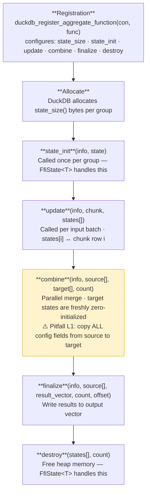

# Architecture

## Table of Contents

- [Module Overview](#module-overview)
- [Design Principles](#design-principles)
- [Dependency Model](#dependency-model)
- [Safety Model](#safety-model)
- [The loadable-extension Feature](#the-loadable-extension-feature)
- [DuckDB Aggregate Lifecycle](#duckdb-aggregate-lifecycle)
- [ADR-001: Thin Wrapper Mandate](#adr-001-thin-wrapper-mandate)
- [ADR-002: Exact Version Pin](#adr-002-exact-version-pin)
- [ADR-003: No Panics Across FFI](#adr-003-no-panics-across-ffi)

---

## Module Overview

```
quack_rs
├── entry_point      Extension initialization sequence
├── aggregate
│   ├── state        FfiState<T> — raw-pointer lifecycle wrapper
│   ├── callbacks    Type aliases for the 6 DuckDB aggregate callback signatures
│   └── builder      AggregateFunctionBuilder, AggregateFunctionSetBuilder
├── vector
│   ├── reader       VectorReader — typed reads from duckdb_data_chunk
│   ├── writer       VectorWriter — typed writes to duckdb_vector
│   ├── validity     ValidityBitmap — NULL flag management
│   └── string       DuckStringView — 16-byte duckdb_string_t format
├── types
│   ├── type_id      TypeId enum — all DuckDB column types
│   └── logical_type LogicalType — RAII for duckdb_logical_type
├── interval         DuckInterval, interval_to_micros (checked + saturating)
├── error            ExtensionError, ExtResult<T>
└── testing
    └── harness      AggregateTestHarness<S> — pure-Rust aggregate testing
```

### Module responsibilities

| Module | Responsibility | FFI |
|--------|---------------|-----|
| `entry_point` | Correct initialization sequence | Yes |
| `aggregate::state` | `Box<T>` lifecycle behind a raw pointer | Yes |
| `aggregate::callbacks` | Signature documentation only (type aliases) | No |
| `aggregate::builder` | Builder API for function registration | Yes |
| `vector::reader` | Typed reads with correct alignment and boolean semantics | Yes |
| `vector::writer` | Typed writes with NULL flag support | Yes |
| `vector::validity` | Bit-packed validity bitmap abstraction | Yes |
| `vector::string` | Inline vs. pointer string format handling | Yes |
| `types::type_id` | Enum mapping to `DUCKDB_TYPE_*` constants | No |
| `types::logical_type` | RAII drop for `duckdb_logical_type` | Yes |
| `interval` | Fixed-point microsecond arithmetic with overflow detection | No |
| `error` | `std::error::Error` + `CString` conversion | No |
| `testing::harness` | Simulate DuckDB aggregate lifecycle in pure Rust | No |

---

## Design Principles

### 1. Thin wrapper

Every abstraction earns its place by reducing boilerplate **or** improving safety.
When in doubt, prefer the simpler option. This crate does not aim to be a complete
DuckDB SDK — it solves the problems that are genuinely hard to get right from first
principles.

### 2. Zero panics across FFI

`unwrap()`, `expect()`, and `panic!()` are forbidden in any code path that may be
invoked by DuckDB. Panicking across a C FFI boundary is undefined behaviour. All
error handling uses `Result`/`Option` and the `?` operator. Errors are reported
back to DuckDB via `access.set_error`.

### 3. Exact version pin

`libduckdb-sys = "=1.4.4"` — the `=` is intentional. DuckDB's C API has changed
between minor releases in ways that break extensions silently. Exact pinning makes
upgrades deliberate and auditable.

### 4. Testable business logic

Aggregate state structs (`T: AggregateState`) have zero FFI dependencies. The
`testing::harness::AggregateTestHarness<T>` simulates the full DuckDB aggregate
lifecycle in pure Rust, letting you test complex business logic without a live
DuckDB instance. Only the FFI glue code (callbacks, registration) requires DuckDB.

---

## Dependency Model

```
Extension crate
    ├── quack_rs (this crate)
    │       ├── libduckdb-sys = "=1.4.4" { loadable-extension }
    │       └── (no other runtime deps)
    └── libduckdb-sys = "=1.4.4" { loadable-extension }
            └── (bundled DuckDB headers only — no linked library)
```

The `loadable-extension` feature of `libduckdb-sys` changes the linkage model:
instead of linking against `libduckdb`, the crate emits a shared library that
receives a function pointer table from DuckDB at load time. See
[The loadable-extension Feature](#the-loadable-extension-feature).

At test time, add `duckdb = { version = "=1.4.4", features = ["bundled"] }` as a
dev-dependency if you need a live DuckDB instance. Note the constraint described
in [CONTRIBUTING.md](../CONTRIBUTING.md#test-strategy).

---

## Safety Model

All `unsafe` code is isolated within this crate. Consumers using the high-level
builder API write 100% safe Rust. Internally:

- Every `unsafe` block has a `// SAFETY:` comment.
- The `#![deny(unsafe_op_in_unsafe_fn)]` lint is enabled globally: unsafe operations
  inside `unsafe fn` still require explicit `unsafe {}` blocks with their own comment.
- Raw pointer validity is enforced through type invariants:
  - `FfiState<T>::init_callback` — caller guarantees `state` points to allocated memory
  - `FfiState<T>::destroy_callback` — sets `inner = null` after freeing (prevents double-free)
  - `VectorReader::new` — caller guarantees `chunk` lives at least as long as the reader

---

## The loadable-extension Feature

When `libduckdb-sys` is compiled with `features = ["loadable-extension"]`:

1. All DuckDB C API functions (`duckdb_connect`, `duckdb_vector_get_data`, etc.) are
   replaced with thin wrappers that dispatch through a global `AtomicPtr` table.
2. The table is `null` at process start.
3. DuckDB calls `duckdb_rs_extension_api_init(info, access, version)` when loading
   the extension, which fills the table.
4. Any call before `duckdb_rs_extension_api_init` panics with
   `"DuckDB API not initialized"`.

**Consequence for tests**: you cannot call any `duckdb_*` function in a `cargo test`
process. Design your state structs and business logic to be testable without DuckDB,
then use `AggregateTestHarness` to simulate the aggregate lifecycle.

---

## DuckDB Aggregate Lifecycle

Understanding this lifecycle is essential for writing correct aggregate callbacks.



The `FfiState<T>` wrapper handles steps 2 and 6 automatically. Your callbacks
implement steps 3, 4, and 5.

### Pitfall L1: combine must propagate configuration fields

DuckDB's parallel execution model calls `state_init` on target states before
`combine`. A target state starts as `T::default()`, not a copy of the source.
This means any configuration field (e.g., `n_conditions: usize`) that was set
during `update` must be explicitly copied in `combine`:

```rust
// CORRECT: propagate all fields
unsafe extern "C" fn combine(_, source: *mut State, target: *mut State, count: idx_t) {
    for i in 0..count as usize {
        let src = &*(*source.add(i) as *const MyState);
        let tgt = &mut *(*target.add(i) as *mut MyState);
        tgt.config_field = src.config_field;  // must copy
        tgt.accumulator += src.accumulator;
    }
}
```

See `testing/harness.rs` for a test that demonstrates this bug and its fix.

---

## ADR-001: Thin Wrapper Mandate

**Context**: It is tempting to add convenience layers, ergonomic macros, or
high-level abstractions on top of the DuckDB C API.

**Decision**: This crate exposes only what is necessary to make the unsafe FFI
patterns safe and correct. It does not attempt to hide the DuckDB C API entirely.
Consumers are expected to understand DuckDB's aggregate and vector model.

**Consequences**: The crate stays small, auditable, and easy to update when the
DuckDB C API changes. Consumers who want a higher-level API can build it on top.

---

## ADR-002: Exact Version Pin

**Context**: `libduckdb-sys` follows DuckDB's version number. Between DuckDB 1.x
releases, the C API has changed in ways that silently break extensions:
- New function signatures
- Changed constant values
- Renamed symbols

**Decision**: Pin `libduckdb-sys = "=1.4.4"`. Never use a range specifier.

**Consequences**: Extensions must explicitly choose when to upgrade DuckDB.
The `duckdb-behavioral` experience motivating this library showed that silent
API changes cost days of debugging.

---

## ADR-003: No Panics Across FFI

**Context**: `panic!` in a `no_std`-adjacent context, or across a C FFI boundary,
is undefined behaviour. DuckDB calls extension callbacks from C++; a Rust panic
propagating into C++ unwinding is UB.

**Decision**: Every callback and entry point uses `Result`/`Option`. Errors are
reported via `access.set_error`. The `panic = "abort"` release profile setting
is a defence-in-depth measure, not a substitute for correct error handling.

**Consequences**: All callbacks are slightly more verbose, but the invariant is
enforced by the type system rather than convention.
