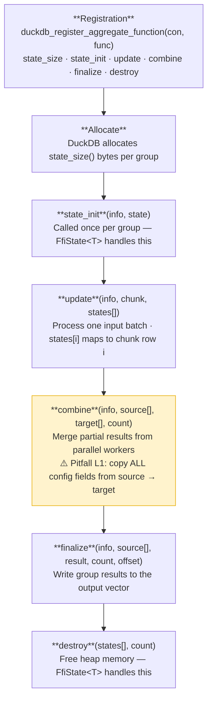

# Architecture

## Table of Contents

- [Module Overview](#module-overview)
- [Design Principles](#design-principles)
- [Dependency Model](#dependency-model)
- [Safety Model](#safety-model)
- [The loadable-extension Feature](#the-loadable-extension-feature)
- [DuckDB Aggregate Lifecycle](#duckdb-aggregate-lifecycle)
- [ADR-001: Thin Wrapper Mandate](#adr-001-thin-wrapper-mandate)
- [ADR-002: Bounded Version Range](#adr-002-bounded-version-range)
- [ADR-003: No Panics Across FFI](#adr-003-no-panics-across-ffi)

---

## Module Overview

```
quack_rs
├── entry_point      Extension initialization (init_extension / init_extension_v2, entry_point! / entry_point_v2!)
├── abi              AbiCheck, AbiPolicy — C Extension API ABI compatibility checking
├── connection       Connection facade + Registrar trait (version-agnostic registration)
├── callback         scalar_callback!, table_scan_callback!, … — panic-safe callback wrapper macros
├── aggregate
│   ├── state        FfiState<T> — raw-pointer lifecycle wrapper
│   ├── callbacks    Type aliases for the 6 DuckDB aggregate callback signatures
│   ├── info         AggregateFunctionInfo — callback info wrapper
│   └── builder/
│       ├── single   AggregateFunctionBuilder (single-signature)
│       ├── set      AggregateFunctionSetBuilder
│       └── overload AggregateOverloadBuilder (`OverloadBuilder` is its deprecated alias)
├── scalar
│   ├── info         ScalarFunctionInfo (+ ScalarBindInfo, ScalarInitInfo with `duckdb-1-5`)
│   ├── typed        ScalarValue, ScalarOut, ScalarFunctionBuilder::map1/map2/… — scalar functions as Rust closures
│   ├── state        ScalarBindData<T>, ScalarLocalState<T> — typed bind data and per-thread state (requires `duckdb-1-5`)
│   └── builder/
│       ├── single   ScalarFn type alias, ScalarFunctionBuilder (+ bind(), init() with `duckdb-1-5`)
│       ├── set      ScalarFunctionSetBuilder
│       └── overload ScalarOverloadBuilder
├── cast
│   └── builder      CastFunctionBuilder, CastFunctionInfo, CastMode
├── table
│   ├── builder      TableFunctionBuilder, BindFn/InitFn/ScanFn type aliases
│   ├── info         BindInfo, InitInfo, FunctionInfo — callback info wrappers
│   ├── bind_data    FfiBindData<T> — type-safe bind-phase data storage
│   ├── init_data    FfiInitData<T>, FfiLocalInitData<T> — scan state storage
│   └── typed        TypedTableFunctionBuilder<S> — closure-based bind/scan with typed state
├── chunk_writer     ChunkWriter — auto-sizing chunk writer for table function scan callbacks
├── appender         Appender — bulk row appender (a few methods need `duckdb-1-5`)
├── arrow            ArrowOptions, ArrowSchema, ArrowArray — Arrow C Data Interface bridge (requires `duckdb-1-5-4`)
├── catalog          Catalog, CatalogEntry, CatalogEntryType — catalog entry lookup (requires `duckdb-1-5`)
├── client_context   ClientContext — client context access (requires `duckdb-1-5`)
├── config_option    ConfigOptionBuilder — extension-defined configuration options (requires `duckdb-1-5`)
├── copy_function    CopyFunctionBuilder, CopyBindInfo, CopySinkInfo — custom COPY handlers (requires `duckdb-1-5`)
├── error_data       ErrorData, DuckDbErrorType — structured error data + UTF-8 validation (requires `duckdb-1-5`)
├── expression       Expression — bound expression inspection / constant folding (requires `duckdb-1-5`)
├── file_system      FileSystem, FileHandle, FileOpenOptions, FileFlag — DuckDB virtual file system (requires `duckdb-1-5`)
├── instance_cache   InstanceCache — shared database instance cache (requires `duckdb-1-5`)
├── selection_vector SelectionVector — zero-copy row-index selection vectors (requires `duckdb-1-5`)
├── replacement_scan ReplacementScanBuilder — SELECT * FROM 'file.xyz' patterns
├── query            QueryResult, PreparedStatement, OwnedConnection — running SQL from inside an extension
├── data_chunk       DataChunk — ergonomic wrapper for duckdb_data_chunk
├── value            Value — RAII wrapper for duckdb_value with typed extraction
├── vector
│   ├── reader       VectorReader — typed reads from duckdb_data_chunk
│   ├── writer       VectorWriter — typed writes to duckdb_vector
│   ├── validity     ValidityBitmap — NULL flag management
│   ├── string       DuckStringView — 16-byte duckdb_string_t format
│   ├── complex      StructVector, ListVector, MapVector, ArrayVector
│   ├── list_builder ListBuilder — safe construction of LIST and MAP output vectors
│   ├── struct_reader StructReader — batched, typed reader for STRUCT input vectors
│   ├── struct_writer StructWriter — batched, typed writer for STRUCT output vectors
│   ├── uuid         uuid_from_storage, uuid_to_storage — UUID bits vs. vector storage
│   └── ops          OwnedVector, slice, copy_selected — whole-vector operations (requires `duckdb-1-5`)
├── types
│   ├── type_id      TypeId enum — all DuckDB column types
│   ├── logical_type LogicalType — RAII for duckdb_logical_type
│   └── null_handling NullHandling — NULL propagation behaviour
├── datetime         Date, Time, TimeTz, Timestamp, Decimal — calendar conversions for temporal types
├── table_description TableDescription — table metadata queries (column_count/column_type need `duckdb-1-5`)
├── sql_macro        SqlMacro — SQL macro registration (scalar and table macros)
├── interval         DuckInterval, interval_to_micros (checked + saturating)
├── config           DbConfig — RAII wrapper for duckdb_config
├── error            ExtensionError, ExtResult<T>
├── secrets          SecretsManager, SecretEntry, DuckDbSecretInfo — credential handling
├── tls              TlsConfigProvider, TlsVersion — type-erased TLS configuration provider
├── warning          ExtensionWarning, WarningSeverity, WarningCollector — structured security warnings
├── validate         Validation utilities for community extension compliance
├── scaffold         Project scaffolding for DuckDB Rust extensions
├── prelude          Convenience re-exports for common extension development
└── testing
    ├── harness          AggregateTestHarness<S> — pure-Rust aggregate testing
    ├── mock_vector      MockVectorReader, MockVectorWriter, MockDuckValue
    ├── mock_registrar   MockRegistrar, CastRecord — registration verification
    └── in_memory_db     InMemoryDb — real DuckDB for SQL-level tests (requires `bundled-test` or `bundled-test-prebuilt`)
```

### Module responsibilities

| Module | Responsibility | FFI |
|--------|---------------|-----|
| `entry_point` | Correct initialization sequence (`init_extension`, `init_extension_v2`) | Yes |
| `abi` | `AbiCheck`, `AbiPolicy` — check the compiled-in C Extension API layout against the loading DuckDB | Yes |
| `connection` | `Connection` facade + `Registrar` trait — version-agnostic registration | Yes |
| `callback` | Macros that wrap a callback body in `catch_unwind` and report a panic through the callback's `set_error` | Yes |
| `aggregate::state` | `Box<T>` lifecycle behind a raw pointer | Yes |
| `aggregate::callbacks` | Signature documentation only (type aliases) | No |
| `aggregate::info` | `AggregateFunctionInfo` — callback info wrapper | Yes |
| `aggregate::builder::single` | `AggregateFunctionBuilder` — single-signature registration | Yes |
| `aggregate::builder::set` | `AggregateFunctionSetBuilder` | Yes |
| `aggregate::builder::overload` | `AggregateOverloadBuilder` — one overload within a set | Yes |
| `scalar::info` | `ScalarFunctionInfo` (+ `ScalarBindInfo`, `ScalarInitInfo` with `duckdb-1-5`) | Yes |
| `scalar::typed` | `ScalarValue`, `ScalarOut`, `ScalarFunctionBuilder::map1`/`map2`/… — scalar functions written as Rust closures | Yes |
| `scalar::state` | `ScalarBindData<T>`, `ScalarLocalState<T>` — typed bind data and per-thread local state (requires `duckdb-1-5`) | Yes |
| `scalar::builder::single` | `ScalarFn` type alias, `ScalarFunctionBuilder` (`bind()` and `init()` are gated behind `duckdb-1-5`; `varargs()` and `volatile()` are not) | Yes |
| `scalar::builder::set` | `ScalarFunctionSetBuilder` | Yes |
| `scalar::builder::overload` | `ScalarOverloadBuilder` — one overload within a set | Yes |
| `cast::builder` | `CastFunctionBuilder`, `CastFunctionInfo`, `CastMode` | Yes |
| `table::builder` | `TableFunctionBuilder`, callback type aliases | Yes |
| `table::info` | `BindInfo`, `InitInfo`, `FunctionInfo` — callback wrappers | Yes |
| `table::bind_data` | `FfiBindData<T>` — type-safe bind-phase data storage | Yes |
| `table::init_data` | `FfiInitData<T>`, `FfiLocalInitData<T>` — scan state storage | Yes |
| `table::typed` | `TypedTableFunctionBuilder<S>` — closure-based bind/scan with typed state (panic-safe trampolines, serial scans) | Yes |
| `chunk_writer` | `ChunkWriter` — sets the output chunk's size from the rows written, on drop | Yes |
| `appender` | `Appender` — bulk row insertion: append rows or a `DataChunk`, flush/close; `append_default_to_chunk`, `clear`, `error_data` and the `ErrorData`-typed `AppendError` need `duckdb-1-5` | Yes |
| `arrow` | `ArrowOptions`, `ArrowSchema`, `ArrowArray` — convert between data chunks and the Arrow C Data Interface (requires `duckdb-1-5-4`) | Yes |
| `catalog` | `Catalog`, `CatalogEntry`, `CatalogEntryType` — catalog entry lookup (requires `duckdb-1-5`) | Yes |
| `client_context` | `ClientContext` — access to connection catalog, config options, and connection ID (requires `duckdb-1-5`) | Yes |
| `config_option` | `ConfigOptionBuilder` — register extension-defined `SET`/`RESET` configuration options (requires `duckdb-1-5`) | Yes |
| `copy_function` | `CopyFunctionBuilder`, `CopyBindInfo`, `CopySinkInfo`, `CopyGlobalInitInfo`, `CopyFinalizeInfo` — custom `COPY TO` handler registration, plus `COPY FROM` via `copy_from` (requires `duckdb-1-5`) | Yes |
| `error_data` | `ErrorData`, `DuckDbErrorType`, `check_valid_utf8` — structured error data and UTF-8 validation (requires `duckdb-1-5`) | Yes |
| `expression` | `Expression` — inspect/constant-fold scalar-function argument expressions at bind time (requires `duckdb-1-5`) | Yes |
| `file_system` | `FileSystem`, `FileHandle`, `FileOpenOptions`, `FileFlag` — read/write via DuckDB's virtual file system (requires `duckdb-1-5`) | Yes |
| `instance_cache` | `InstanceCache` — share one database instance across opens of the same path (requires `duckdb-1-5`) | Yes |
| `selection_vector` | `SelectionVector` — allocate/fill zero-copy row-index vectors (requires `duckdb-1-5`) | Yes |
| `table_description` | `TableDescription` — query a table's column names and defaults at runtime; `column_count` and `column_type` need `duckdb-1-5` | Yes |
| `replacement_scan` | `ReplacementScanBuilder` — `SELECT * FROM 'file.xyz'` registration | Yes |
| `query` | `QueryResult`, `PreparedStatement`, `OwnedConnection` — RAII handles for running SQL from inside an extension | Yes |
| `data_chunk` | `DataChunk` — safe access to a `duckdb_data_chunk`'s vectors and metadata | Yes |
| `value` | `Value` — RAII wrapper for `duckdb_value` with typed extraction (`display_string`, `time_ns`, `as_time_ns` need `duckdb-1-5`) | Yes |
| `vector::reader` | Typed reads with correct alignment and boolean semantics | Yes |
| `vector::writer` | Typed writes with NULL flag support | Yes |
| `vector::validity` | Bit-packed validity bitmap abstraction | Yes |
| `vector::string` | Inline vs. pointer string format handling | Yes |
| `vector::complex` | `StructVector`, `ListVector`, `MapVector`, `ArrayVector` — nested type access | Yes |
| `vector::list_builder` | `ListBuilder` — safe construction of `LIST` and `MAP` output vectors | Yes |
| `vector::struct_reader` | `StructReader` — batched, typed reader for `STRUCT` input vectors | Yes |
| `vector::struct_writer` | `StructWriter` — batched, typed writer for `STRUCT` output vectors | Yes |
| `vector::uuid` | `uuid_from_storage`, `uuid_to_storage` — convert between a `UUID`'s text bits and its vector storage | No |
| `vector::ops` | `OwnedVector`, `slice`, `copy_selected` — whole-vector operations (requires `duckdb-1-5`) | Yes |
| `types::type_id` | Enum mapping to `DUCKDB_TYPE_*` constants | No |
| `types::logical_type` | RAII drop for `duckdb_logical_type` | Yes |
| `datetime` | `Date`, `Time`, `TimeTz`, `Timestamp`, `Decimal` — calendar conversions via DuckDB's stable C API | Yes |
| `config` | `DbConfig` — RAII wrapper for `duckdb_config` | Yes |
| `interval` | Fixed-point microsecond arithmetic with overflow detection | No |
| `error` | `std::error::Error` + `CString` conversion | No |
| `sql_macro` | `SqlMacro` — register scalar and table SQL macros via `CREATE MACRO` | Yes |
| `secrets` | `SecretsManager`, `SecretEntry`, `DuckDbSecretInfo` — credential handling for extensions (reads `duckdb_secrets()` through `query`) | Yes |
| `tls` | `TlsConfigProvider`, `TlsVersion` — type-erased TLS configuration provider for HTTP-capable extensions | No |
| `warning` | `ExtensionWarning`, `WarningSeverity`, `WarningCollector` — structured security warnings | No |
| `validate` | Validation utilities for community extension compliance (names, SPDX, semver, etc.) | No |
| `scaffold` | Project scaffolding — generates the full file set for a DuckDB Rust extension | No |
| `prelude` | Convenience re-exports for the most commonly used items | No |
| `testing::harness` | Simulate DuckDB aggregate lifecycle in pure Rust | No |
| `testing::mock_vector` | In-memory `MockVectorReader` / `MockVectorWriter` for callback testing | No |
| `testing::mock_registrar` | `MockRegistrar` — records registrations without a DuckDB connection | No |
| `testing::in_memory_db` | `InMemoryDb` — real DuckDB for SQL-level tests (requires `bundled-test` or `bundled-test-prebuilt`) | Yes |

---

## Design Principles

### 1. Thin wrapper

Every abstraction earns its place by reducing boilerplate **or** improving safety.
When in doubt, prefer the simpler option. This crate does not aim to be a complete
DuckDB SDK — it solves the problems that are genuinely hard to get right from first
principles.

### 2. Zero panics across FFI

`unwrap()`, `expect()`, and `panic!()` are forbidden in any code path that may be
invoked by DuckDB. A panic escaping a C FFI boundary aborts the process (Rust ≥ 1.81;
undefined behaviour before that). All
error handling uses `Result`/`Option` and the `?` operator. Errors are reported
back to DuckDB via `access.set_error`.

### 3. Bounded version range

`libduckdb-sys = ">=1.4.4, <2"` — the range is intentional. DuckDB's C API is
stable across the 1.4.x and 1.5.x releases (both use C API `v1.2.0`, verified by
E2E tests). The upper bound prevents silent adoption of a new major-band whose
C API may introduce breaking changes.

### 4. Testable business logic

Aggregate state structs (`T: AggregateState`) have zero FFI dependencies. The
`testing::harness::AggregateTestHarness<T>` simulates the full DuckDB aggregate
lifecycle in pure Rust, letting you test complex business logic without a live
DuckDB instance. Only the FFI glue code (callbacks, registration) requires DuckDB.

---

## Dependency Model

```
Extension crate
    ├── quack_rs (this crate)
    │       ├── libduckdb-sys = ">=1.4.4, <2" { loadable-extension }
    │       ├── mutants = "0.0.4" (a no-op `#[mutants::skip]` attribute)
    │       └── duckdb = ">=1.4.4, <2" (optional: only with `bundled-test` / `bundled-test-prebuilt`)
    └── libduckdb-sys = ">=1.4.4, <2" { loadable-extension }
            └── (DuckDB headers only — no linked library)
```

Three cargo features gate DuckDB 1.5 C API surface. Each is defined in the
crate's `Cargo.toml`, carries no extra dependencies, and only controls `#[cfg]`
gates:

- `duckdb-1-5` (DuckDB 1.5.0+) gates the modules `catalog`, `client_context`,
  `config_option`, `copy_function`, `error_data`, `expression`, `file_system`,
  `instance_cache` and `selection_vector`, and the submodules `scalar::state` and
  `vector::ops`. It also enables items inside otherwise-ungated modules, e.g.
  `ScalarFunctionBuilder::bind()`/`init()`, `ScalarBindInfo`/`ScalarInitInfo`,
  `Appender::append_default_to_chunk`/`clear`/`error_data`,
  `TableDescription::column_count`/`column_type`, and `Value::display_string`/
  `time_ns`/`as_time_ns`.
- `duckdb-1-5-3` implies `duckdb-1-5` and gates `TypeId::Geometry` and
  `TypeId::Variant`.
- `duckdb-1-5-4` implies `duckdb-1-5-3` and gates the `arrow` module.

`appender`, `table_description` and `ScalarFunctionBuilder::varargs()`/`volatile()`
use the stable C API and need no feature.

The `loadable-extension` feature of `libduckdb-sys` changes the linkage model:
instead of linking against `libduckdb`, the crate emits a shared library that
receives a function pointer table from DuckDB at load time. See
[The loadable-extension Feature](#the-loadable-extension-feature).

For SQL-level tests against a live DuckDB, enable quack-rs's `bundled-test` (or
`bundled-test-prebuilt`) feature and use `quack_rs::testing::InMemoryDb`. Do
**not** add `duckdb = { features = ["bundled"] }` as a dev-dependency of an
extension crate: Cargo unifies it with the extension's `loadable-extension`
feature, and the first DuckDB call then panics with "DuckDB API not initialized"
(Pitfall P9 in `LESSONS.md`).

---

## Safety Model

Within this crate:

- The `#![deny(unsafe_op_in_unsafe_fn)]` lint is enabled globally: unsafe operations
  inside `unsafe fn` still require explicit `unsafe {}` blocks with their own comment.
- Raw pointer validity is enforced through type invariants:
  - `FfiState<T>::init_callback` — caller guarantees `state` points to allocated memory
  - `FfiState<T>::destroy_callback` — sets `inner = null` after freeing (prevents double-free)
  - `VectorReader::new` — caller guarantees `chunk` lives at least as long as the reader

---

## The loadable-extension Feature

When `libduckdb-sys` is compiled with `features = ["loadable-extension"]`:

1. All DuckDB C API functions (`duckdb_connect`, `duckdb_vector_get_data`, etc.) are
   replaced with thin wrappers that dispatch through a global `AtomicPtr` per function.
2. Those pointers are `null` at process start.
3. DuckDB calls `duckdb_rs_extension_api_init(info, access, version)` when loading
   the extension, which fills them in.
4. Any call before `duckdb_rs_extension_api_init` panics with
   `"DuckDB API not initialized or DuckDB feature omitted"`.

**Consequence for tests**: without the `bundled-test` / `bundled-test-prebuilt`
features, you cannot call any `duckdb_*` function in a `cargo test` process. Design
your state structs and business logic to be testable without DuckDB, then use
`AggregateTestHarness` to simulate the aggregate lifecycle. With either feature,
`InMemoryDb::open()` fills the table from the linked DuckDB first.

---

## DuckDB Aggregate Lifecycle

Understanding this lifecycle is essential for writing correct aggregate callbacks.


```mermaid
flowchart TD
    REG["**Registration**<br/>duckdb_register_aggregate_function(con, func)<br/>state_size · state_init · update · combine · finalize · destroy"]

    REG     --> ALLOC
    ALLOC   --> INIT
    INIT    --> UPDATE
    UPDATE  --> COMBINE
    COMBINE --> FINAL
    FINAL   --> DESTROY

    ALLOC["**Allocate**<br/>DuckDB allocates state_size() bytes per group"]
    INIT["**state_init**(info, state)<br/>Called once per group — FfiState&lt;T&gt; handles this"]
    UPDATE["**update**(info, chunk, states[])<br/>Process one input batch · states[i] maps to chunk row i"]
    COMBINE["**combine**(info, source[], target[], count)<br/>Merge partial results from parallel workers<br/>⚠️ Pitfall L1: copy ALL config fields from source → target"]
    FINAL["**finalize**(info, source[], result, count, offset)<br/>Write group results to the output vector"]
    DESTROY["**destroy**(states[], count)<br/>Free heap memory — FfiState&lt;T&gt; handles this"]

    style COMBINE fill:#fff3cd,stroke:#e6ac00,color:#333
```

`FfiState<T>` supplies the `state_size`, `state_init` and `destroy` callbacks
(`size_callback`, `init_callback`, `destroy_callback`). Your callbacks implement
`update`, `combine`, and `finalize`.

### Pitfall L1: combine must propagate configuration fields

DuckDB creates fresh target states with `state_init` (for `FfiState<T>`,
`T::default()`) and then calls `combine` to merge source states into them. A
target state is not a copy of the source.
This means any configuration field (e.g., `n_conditions: usize`) that was set
during `update` must be explicitly copied in `combine`:

```rust
// CORRECT: propagate all fields
unsafe extern "C" fn combine(
    _info: duckdb_function_info,
    source: *mut duckdb_aggregate_state,
    target: *mut duckdb_aggregate_state,
    count: idx_t,
) {
    for i in 0..count as usize {
        if let (Some(src), Some(tgt)) = (
            FfiState::<MyState>::with_state(*source.add(i)),
            FfiState::<MyState>::with_state_mut(*target.add(i)),
        ) {
            tgt.config_field = src.config_field; // must copy
            tgt.accumulator += src.accumulator;
        }
    }
}
```

See `testing/harness.rs` for a test that demonstrates this bug and its fix.

---

## ADR-001: Thin Wrapper Mandate

**Context**: It is tempting to add convenience layers, ergonomic macros, or
high-level abstractions on top of the DuckDB C API.

**Decision**: This crate exposes only what is necessary to make the unsafe FFI
patterns safe and correct. It does not attempt to hide the DuckDB C API entirely.
Consumers are expected to understand DuckDB's aggregate and vector model.

**Consequences**: The crate stays small, auditable, and easy to update when the
DuckDB C API changes. Consumers who want a higher-level API can build it on top.

---

## ADR-002: Bounded Version Range

**Context**: `libduckdb-sys` versions track DuckDB releases (DuckDB 1.5.x is
published as `libduckdb-sys` 1.105xx). Between DuckDB major releases, the C API
can change in ways that silently break extensions:
- New function signatures
- Changed constant values
- Renamed symbols

**Decision**: Use `libduckdb-sys = ">=1.4.4, <2"`. The range covers DuckDB 1.4.4+
and 1.5.x, whose C API (`v1.2.0`) is stable and verified by E2E tests against both
releases. The `<2` upper bound prevents silent adoption of a future major release
that may introduce breaking C API changes.

**Consequences**: Extensions must explicitly choose when to upgrade DuckDB.
The `duckdb-behavioral` experience motivating this library showed that silent
API changes cost days of debugging.

---

## ADR-003: No Panics Across FFI

**Context**: a panic cannot unwind out of an `extern "C"` function. Before Rust
1.81 that was undefined behaviour; since 1.81 the runtime aborts the process.
DuckDB calls extension callbacks from C++, so either way an escaping panic takes
down the user's session.

**Decision**: Every callback and entry point uses `Result`/`Option`. Errors are
reported via `access.set_error`. As defence in depth, the entry point, the
closure-based builders' trampolines and the `callback` macros also run user code
under `catch_unwind`, which is why the release profile must use
`panic = "unwind"` (under `abort`, nothing can be caught).

**Consequences**: All callbacks are slightly more verbose, but the invariant is
enforced by the type system rather than convention.
